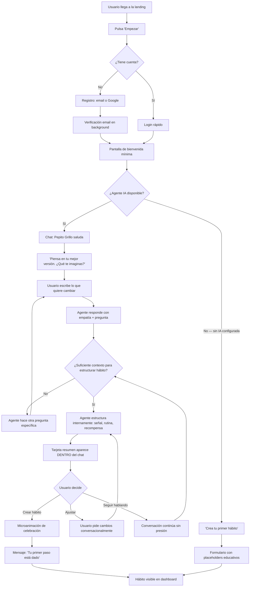
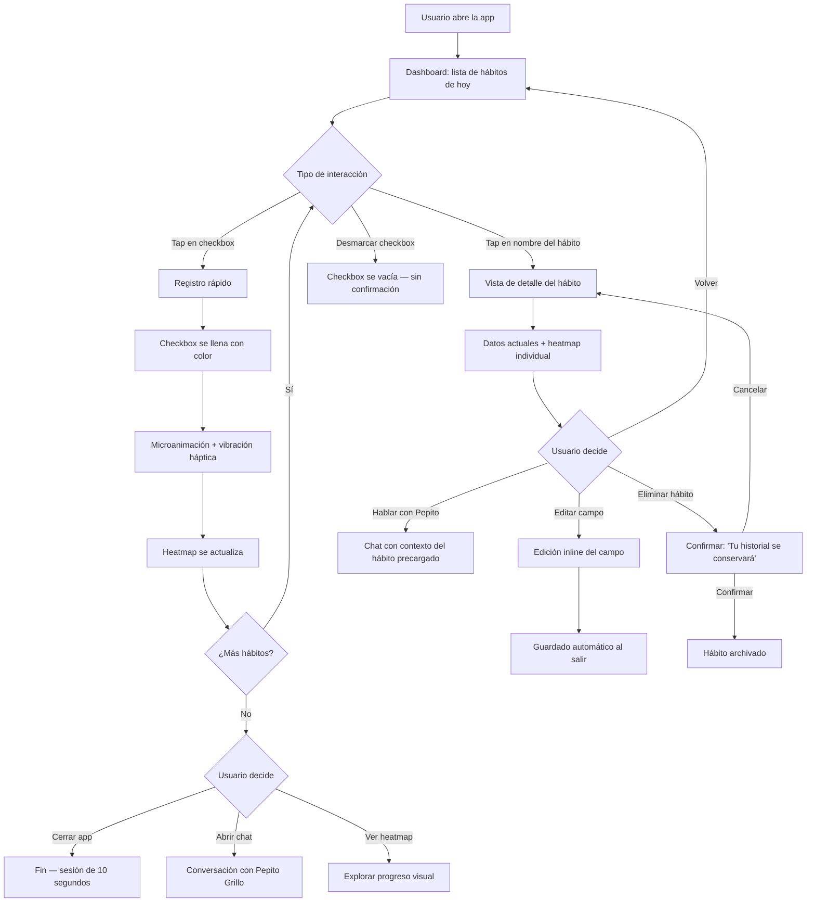
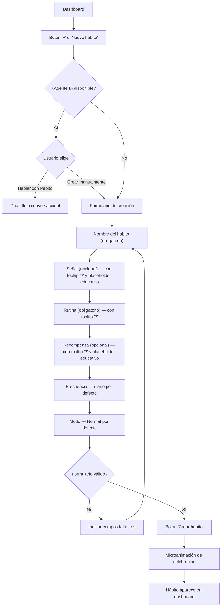
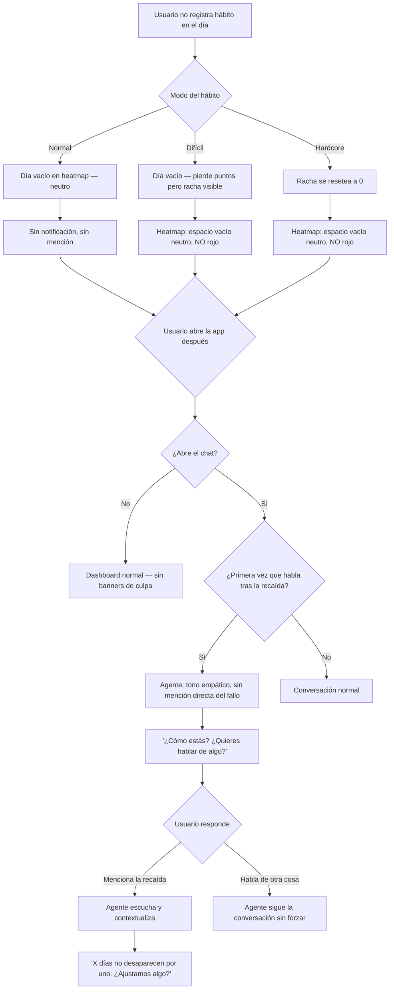
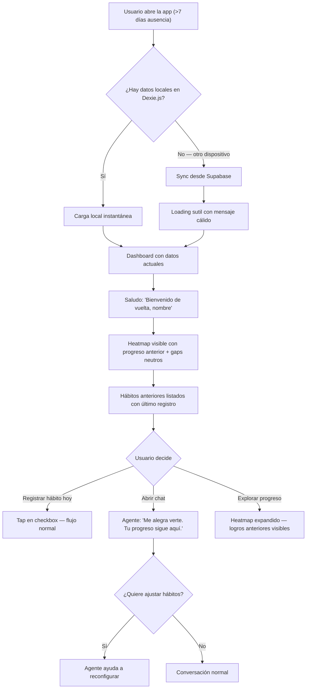
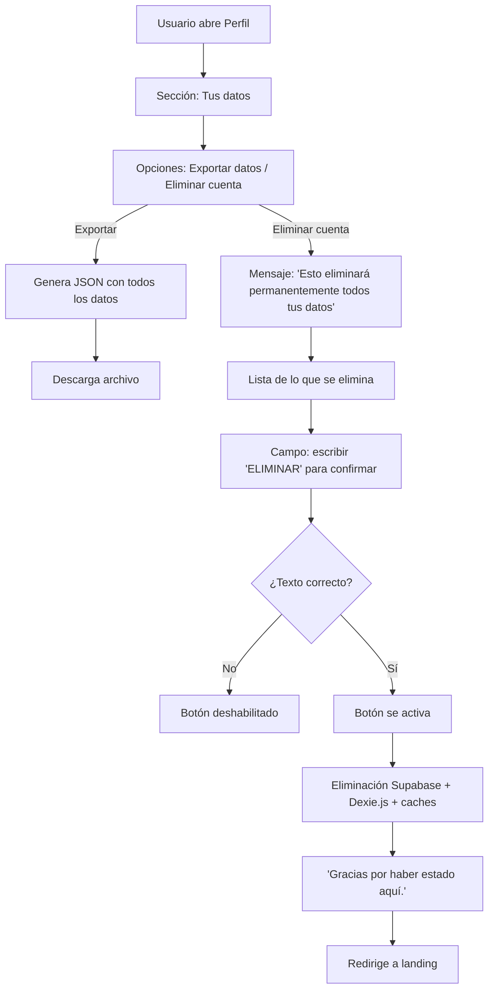

# UX Design Specification primer-bmad

**Author:** Manuel
**Date:** 2026-03-16

---

## Executive Summary

### Project Vision

Primer es una PWA de desarrollo personal para hispanohablantes que reemplaza el paradigma dominante de apps de hábitos (formulario → tracking → castigo) por uno conversacional (reflexión guiada → la app se configura sola → acompañamiento sin juicio). El Pepito Grillo — un agente IA basado en Hábitos Atómicos — es el corazón del producto, no un feature adicional. La app debe sentirse como un lugar seguro de reflexión personal, no como una herramienta de productividad.

### Target Users

**Segmento prioritario para MVP: Marta (adulta joven, 28-35)**
- Usuaria de apps y redes sociales, no técnica (no sabe qué es una API)
- Ha leído sobre hábitos pero no ha logrado implementarlos
- Decepcionada con apps que la juzgan o la hacen sentir culpable
- Busca guía empática, no métricas frías
- Dispositivo principal: móvil Android, descubre vía búsqueda o redes sociales

**Segmento de crecimiento: Diego (estudiante, 18-24)**
- Gamer casual que entiende mecánicas de progresión y recompensa
- Principal candidato para monetización (cosméticos, pase de temporada)
- Cuanto antes aprenda patrones de hábitos correctos, más impacto a largo plazo
- Llega por contenido de influencers en redes sociales

**Segmento de alto valor emocional: Roberto (adulto, 40-50)**
- Hábitos de alta carga emocional (dejar de fumar, salud)
- Necesita que una recaída no borre el progreso anterior
- El usuario que genera las historias más poderosas de producto

**Nivel técnico compartido:** Usuarios de WhatsApp, Instagram, redes sociales. Cómodos con apps pero no con configuraciones técnicas. El modelo mental de referencia es "chatear con alguien", no "configurar una herramienta".

**Contexto de uso:** Sin momento específico del día. La app es un lugar donde ir a reflexionar cuando lo necesites — mañana, noche, o cualquier momento. Dos modos de uso distintos: (1) registro rápido de un tap, (2) conversación reflexiva con el agente.

### Key Design Challenges

1. **Onboarding conversacional sin fricción.** La primera interacción con el Pepito Grillo define si el usuario se queda. Si no entiende que debe hablar, si la respuesta tarda, o si parece un chatbot genérico, se pierde. Hay que diseñar los primeros 2 minutos como si fueran existenciales — porque lo son.

2. **Dualidad reflexión/acción en una misma interfaz.** La app necesita funcionar como espacio de conversación profunda (cuando el usuario quiere reflexionar) Y como herramienta de registro ultrarrápido (cuando solo quiere marcar su hábito). Dos modos de uso muy distintos que deben coexistir sin confundir.

3. **Transición conversación → datos estructurados.** El agente genera hábitos, señales y recompensas desde la conversación. El usuario necesita ver el resultado de esa conversación de forma clara sin salir del flujo. El reto es mostrar estructura sin romper la intimidad del chat.

4. **Mobile-first con contenido denso.** Heatmap de 12 meses, lista de hábitos activos, acceso al agente, registro rápido — todo en una pantalla de 320-639px. La jerarquía visual tiene que ser implacable.

### Design Opportunities

1. **Modelo mental de WhatsApp como superpoder.** Los usuarios ya saben chatear. Si la interfaz conversacional se siente natural (no como un formulario disfrazado), la curva de aprendizaje es cero. La familiaridad del chat elimina fricción de onboarding.

2. **El heatmap como espejo emocional, no como gráfico de datos.** Espacios vacíos como pausas (no fracasos), gradientes cálidos, sin rojo punitivo. Una oportunidad visual para diferenciarse de toda la competencia y comunicar la filosofía anti-castigo.

3. **Anti-patrones como lenguaje visual.** La ausencia de castigo puede traducirse en una identidad visual propia: colores cálidos, transiciones suaves, microinteracciones que celebran sin presionar. La estética ES la filosofía.

4. **Revelación progresiva como motor de curiosidad.** No mostrar todo desde el día 1. Que el heatmap se vaya llenando, que las opciones aparezcan cuando tienen sentido. Menos es más al principio — la complejidad se desbloquea con el uso.

## Core User Experience

### Defining Experience

Primer tiene dos acciones core que definen el producto, con pesos distintos:

**Acción #1 — Registrar el hábito (la más frecuente):**
Registro diario de mínima fricción. Un checkbox por hábito, un tap, hecho. Idealmente desde un widget en la homescreen del teléfono (post-MVP), y siempre desde un apartado dedicado en la app. Click > swipe — lo más directo posible.

**Acción #2 — Conversar con el Pepito Grillo (la más crítica):**
La conversación con el agente IA es lo que diferencia a Primer de toda la competencia. La primera conversación es existencial: si falla, no hay segunda oportunidad. Es el momento donde el usuario reflexiona sobre sí mismo y la app demuestra que es distinta.

**Acción #3 — Admirar logros y personalizar:**
Ver el progreso acumulado (heatmap, cumbres) y personalizar el perfil/estética. Es la acción que refuerza el hábito de volver y, en el segmento Diego, el motor de monetización.

### Platform Strategy

- **PWA mobile-first:** Diseño primario para 320-639px, touch-based
- **Desktop como segundo dispositivo natural:** El usuario puede tener Primer abierto en el ordenador mientras realiza tareas relacionadas con sus hábitos. No es un afterthought — es un caso de uso real
- **Offline obligatorio:** Registro de hábitos funciona sin conexión. Sincronización en background
- **Sincronización visible:** Icono de nube + tic que confirma estado sincronizado. Sutil pero presente — el usuario sabe que sus datos están seguros y disponibles en todos sus dispositivos
- **Widget homescreen (post-MVP):** Checkboxes de hábitos accesibles sin abrir la app

### Effortless Interactions

1. **Registro de hábito = un tap.** Checkbox en apartado dedicado. Sin pantallas intermedias, sin confirmación, sin animaciones que bloqueen. Tap → registrado → feedback visual instantáneo.

2. **La conversación genera datos sin formularios.** El usuario habla con el Pepito Grillo y el hábito se estructura solo (señal, rutina, recompensa). Nunca rellena un formulario.

3. **Confirmación humana para acciones del agente.** Cada vez que el agente va a tocar datos del usuario (crear hábito, modificar, eliminar), muestra una alerta sencilla con dos opciones (confirmar/cancelar). Human-in-the-loop siempre — el usuario mantiene el control.

4. **Sincronización invisible con feedback visual.** La sync multi-dispositivo funciona sola. El usuario solo ve un icono de nube + tic cuando está sincronizado. Sin configuración, sin conflictos visibles.

5. **Onboarding sin pasos explícitos.** No hay "paso 1 de 5". La primera conversación ES el onboarding. El usuario empieza hablando y termina con un hábito configurado.

### Critical Success Moments

1. **Momento "aha!" #1 — La primera conversación (existencial).** El usuario le cuenta al Pepito Grillo qué quiere cambiar. El agente responde con empatía, hace las preguntas correctas, y el usuario siente que por primera vez algo le escucha sin juzgar. La reflexión sobre sí mismo es la recompensa. Si este momento no funciona, no hay producto.

2. **Momento "aha!" #2 — El hábito estructurado sin formularios.** Al terminar la conversación, el usuario ve su hábito organizado (señal, rutina, recompensa) sin haber rellenado nada. "¿Esto lo hizo la conversación?" La magia es la ausencia de fricción.

3. **Momento "aha!" #3 — La primera semana de heatmap.** 7 cuadraditos de color. Es la primera vez que muchos usuarios mantienen un hábito una semana entera. El progreso visual es la prueba de que algo está cambiando.

4. **Momento de riesgo — La primera recaída.** Si el usuario falla un día y la app le castiga (visual o tonalmente), se va. La respuesta debe ser: espacio vacío sin drama + agente disponible sin forzar. Este momento separa a Primer de toda la competencia.

### Experience Principles

1. **La reflexión es el producto, no el tracking.** El valor de Primer no es registrar datos — es ayudar a las personas a pensar sobre quiénes quieren ser. El tracking es la consecuencia, no el objetivo.

2. **Un tap o nada.** Cada interacción frecuente debe resolverse en un tap. Si requiere más, hay que rediseñar. La fricción es el enemigo de la consistencia.

3. **El usuario siempre tiene el control.** El agente sugiere, nunca impone. Las acciones sobre datos requieren confirmación humana. La app es un compañero, no un sistema automatizado.

4. **Los espacios vacíos son pausas, no fracasos.** Ningún elemento visual, textual o interactivo debe comunicar castigo, culpa o presión por ausencia. La vida pasa — la app espera.

5. **Menos al principio, más con el uso.** Revelación progresiva. El día 1 es simple. La complejidad se desbloquea cuando tiene sentido. No abrumar nunca al usuario nuevo.

## Desired Emotional Response

### Primary Emotional Goals

1. **Seguridad y confianza.** El usuario debe sentir que Primer es un espacio privado donde puede hablar de sus inseguridades más profundas sin miedo. Esto es fundacional — sin esta emoción, ninguna otra funciona. El usuario comparte vulnerabilidades con el agente, y eso requiere un nivel de confianza comparable al de un diario personal.

2. **Sentirse escuchado sin ser juzgado.** La interacción con el Pepito Grillo debe generar la sensación de que alguien (algo) te entiende. No da sermones, no impone, no juzga. Escucha, pregunta, y te ayuda a pensar. Es la emoción que diferencia a Primer de toda la competencia.

3. **Orgullo silencioso por el progreso.** No un orgullo ruidoso ni competitivo — uno íntimo. Ver el heatmap llenarse, notar que algo que antes costaba ahora es automático. La app refleja tu transformación sin compararla con nadie.

### Emotional Journey Mapping

| Momento | Emoción objetivo | Emoción a evitar | Implicación de diseño |
|---------|-----------------|------------------|----------------------|
| **Primera apertura** | Curiosidad directa — "Piensa en tu mejor versión, ¿qué te imaginas?" | Desconfianza, sensación de "otro chatbot" | Ir al grano del producto. Sin tutoriales, sin pasos. Una pregunta poderosa. |
| **Primera conversación** | Vulnerabilidad segura — sentirse escuchado | Vergüenza, incomodidad por hablar con IA | Tono cercano, preguntas abiertas, nunca forzar. Indicadores claros de privacidad. |
| **Hábito creado** | Sorpresa positiva — "ya empecé sin rellenar nada" | Confusión post-conversación | Transición clara: resumen visual del hábito con confirmación explícita. |
| **Registro diario** | Micro-celebración dopamínica + satisfacción rápida | Obligación, carga, rutina pesada | Feedback visual/sensorial inmediato al tap: color, animación sutil, micro-recompensa. |
| **Heatmap llenándose** | Orgullo silencioso, acumulación visual | Presión por racha perfecta | Gradientes cálidos, sin contadores de racha prominentes. El heatmap crece, no cuenta. |
| **Día que fallas** | Neutralidad — la vida pasa | Culpa, castigo, vergüenza | Espacio vacío sin color negativo. Sin notificación. Sin mención al volver. |
| **Volver tras ausencia** | Bienvenida cálida — "sigues aquí, tu progreso también" | Contadores de ausencia, tono pasivo-agresivo | Mensaje positivo orientado al futuro. Progreso anterior visible como logro. |
| **Conversación profunda** | Reflexión, autoconocimiento, insight | Sentirse sermoneado o juzgado | El agente pregunta más de lo que afirma. Nunca impone conclusiones. |
| **Compartir datos personales** | Seguridad — "mis datos están protegidos" | Miedo a exposición, desconfianza | Indicadores visibles de privacidad, cifrado comunicado, control total del usuario sobre sus datos. |

### Micro-Emotions

**Micro-celebración en el registro diario:**
El tap de registro debe generar un micro-momento de dopamina: un color que aparece suavemente, quizá una microanimación o vibración háptica sutil. No un fuego artificial — algo que tu cerebro registre como "bien hecho" sin necesitar atención consciente. La línea entre celebración y presión es delgada: celebrar cuando registras, pero nunca señalar cuando no lo haces.

**Confianza progresiva con el agente:**
La primera conversación genera curiosidad. La tercera genera familiaridad. Al mes, el usuario siente que el Pepito Grillo "le conoce". Esta confianza progresiva es clave para que el usuario comparta cada vez más y la experiencia se profundice.

**Seguridad de datos como emoción, no como feature:**
La privacidad no es un checkbox legal — es una emoción. El usuario necesita SENTIR que sus inseguridades más profundas están protegidas. Esto se comunica con señales visuales sutiles (icono de privacidad en el chat), con lenguaje claro ("solo tú puedes ver esto"), y con control total sobre sus datos (exportar, eliminar en cualquier momento).

### Design Implications

| Emoción objetivo | Decisión de diseño |
|-----------------|-------------------|
| Seguridad / confianza | Indicadores de privacidad en la interfaz del chat. Mensajes claros sobre quién ve los datos ("Solo tú"). Acceso fácil a eliminar datos. Sin tracking de terceros visible. |
| Sentirse escuchado | El agente usa el nombre del usuario. Referencia conversaciones anteriores. Las preguntas son específicas, no genéricas. Tiempo de respuesta que no se sienta robótico. |
| Micro-celebración | Feedback visual inmediato al registrar: transición de color en el checkbox, microanimación en el heatmap. Vibración háptica sutil (si el dispositivo lo soporta). |
| Orgullo silencioso | El heatmap como pieza visual central. Sin comparaciones. Sin leaderboards. El progreso es tuyo y de nadie más. |
| Neutralidad en el fallo | Cero elementos visuales negativos: sin rojo, sin X, sin contadores descendentes. Espacio vacío = pausa natural. |
| Bienvenida cálida | Mensaje personalizado al volver. Sin mención de tiempo ausente. Progreso anterior visible. Tono orientado al futuro. |

### Emotional Design Principles

1. **La seguridad emocional es prerrequisito.** Antes de que el usuario pueda reflexionar, necesita sentir que sus datos y sus palabras están protegidos. Cada decisión de diseño debe reforzar esta confianza.

2. **Celebrar sin presionar.** El feedback positivo es inmediato y sensorial (color, movimiento, háptica). Pero la ausencia de feedback nunca es castigo. Celebrar el sí sin señalar el no.

3. **La empatía se diseña, no se declara.** No basta con decir "somos empáticos" — hay que diseñar cada interacción para que se sienta así. El agente pregunta antes de afirmar. La app espera antes de empujar. Los errores se manejan con calidez.

4. **La confianza se construye con transparencia.** El usuario sabe qué datos tiene la app, dónde están, y puede eliminarlos cuando quiera. No hay letra pequeña. El control sobre los datos es visible y accesible.

5. **La dopamina al servicio del hábito, no de la app.** Los micro-momentos de celebración refuerzan el hábito real del usuario, no el hábito de abrir la app. La adicción a la app no es un objetivo — la autonomía del usuario sí.

## UX Pattern Analysis & Inspiration

### Inspiring Products Analysis

**Claude (Anthropic)**

| Aspecto | Análisis |
|---------|----------|
| **Problema que resuelve** | Un espacio donde pensar, reflexionar y trabajar con un compañero IA empático |
| **Patrón clave: Proyectos** | La organización por proyectos es directamente transferible: cada hábito en Primer es como un proyecto en Claude — un espacio con contexto acumulado que enriquece las conversaciones futuras del agente |
| **Enganche emocional** | Los LLMs son empáticos por naturaleza. El usuario siente que tiene un rincón donde charlar sin juicio. Es exactamente la sensación que el Pepito Grillo necesita replicar |
| **Retención** | Los usuarios vuelven porque pueden comentar cualquier cosa y sienten que sus datos están seguros. La confianza en la privacidad es el motor de retención — no la gamificación |
| **UX destacable** | Interfaz conversacional limpia, sin ruido visual. El chat es el centro. La estructura (proyectos, artefactos) emerge de la conversación, no la precede |

**Loop Habits**

| Aspecto | Análisis |
|---------|----------|
| **Problema que resuelve** | Tracking de hábitos simple y directo, sin suscripciones |
| **Patrón clave: Registro sin abrir la app** | Las notificaciones que permiten confirmar un hábito directamente (sí/no) sin abrir la app son el patrón de mínima fricción por excelencia. Los usuarios vuelven precisamente porque no tienen que "volver" — el registro ocurre fuera de la app |
| **Visualización de datos** | Gráficos de racha, heatmaps, estadísticas. La visualización del progreso acumulado es lo que da peso emocional al tracking |
| **Debilidad clara** | UI anticuada que no se ha adaptado a estándares modernos. La funcionalidad es sólida pero la experiencia visual no comunica calidez ni modernidad. Oportunidad directa para Primer |
| **Retención** | Puramente funcional — vuelven por la utilidad, no por la emoción. Primer puede superar esto combinando la utilidad de Loop con la conexión emocional de Claude |

### Transferable UX Patterns

**De Claude → Primer:**

- **Hábito como proyecto contextual.** Cada hábito acumula conversaciones, registros y contexto. Cuando el usuario habla con el Pepito Grillo sobre un hábito específico, el agente tiene todo el historial. El hábito no es un dato — es un espacio vivo.
- **Chat como interfaz principal.** La conversación es limpia, centrada, sin distracciones. El contenido estructurado (hábitos, resúmenes) emerge dentro del chat como tarjetas o bloques, no en pantallas separadas.
- **Privacidad como experiencia.** La sensación de seguridad no se comunica con una página legal — se comunica con diseño: interfaz íntima, sin elementos sociales, sin tracking visible.

**De Loop Habits → Primer:**

- **Registro fuera de la app.** En Loop es vía notificación; en Primer será vía widget en homescreen (post-MVP). El principio es el mismo: el hábito se registra donde el usuario ya está, no donde la app quiere que vaya.
- **Visualización de progreso como recompensa.** El heatmap y los gráficos de racha son lo que convierte datos fríos en motivación visual. Primer toma este patrón pero lo eleva con gradientes cálidos y sin penalización visual.

### Anti-Patterns to Avoid

| Anti-patrón | Dónde se ve | Por qué evitarlo en Primer |
|-------------|------------|---------------------------|
| **UI anticuada / fría** | Loop Habits | La funcionalidad sin calidez visual no comunica empatía. Primer necesita que la estética refuerce la filosofía. |
| **Notificaciones push en PWA** | Múltiples apps | Complicadas técnicamente en web, invasivas si no se gestionan bien, y riesgo de contradecir la filosofía anti-presión. Widget > notificaciones. |
| **Formularios de configuración** | Apps de hábitos tradicionales | Si el usuario tiene que rellenar campos para crear un hábito, perdemos la magia de "la conversación lo configura todo". Formularios solo como fallback manual. |
| **Datos sociales visibles** | Habitica, redes sociales | Leaderboards, comparaciones, actividad de otros usuarios — todo esto contradice la intimidad que necesita Primer. El progreso es privado por defecto. |
| **Onboarding con slides/tutoriales** | La mayoría de apps | 5 slides explicando cómo funciona la app = 5 oportunidades de que el usuario cierre. En Primer, el onboarding ES la primera conversación. |

### Design Inspiration Strategy

**Adoptar directamente:**
- Interfaz conversacional limpia estilo Claude — el chat como centro de la experiencia
- Concepto de hábito como espacio contextual (inspirado en proyectos de Claude)
- Heatmap de progreso de Loop Habits como pieza visual central
- Registro de un tap / checkbox sin abrir flujos complejos

**Adaptar para Primer:**
- El widget de homescreen (post-MVP) como evolución del patrón de "registro sin abrir la app" de Loop Habits — pero con checkboxes en vez de notificaciones
- La visualización de datos de Loop pero con lenguaje visual cálido y sin penalización (gradientes en vez de rojo/verde binario)
- La sensación de privacidad de Claude pero comunicada de forma más explícita — indicadores visuales de que "solo tú ves esto"

**Evitar:**
- UI funcional pero fría (Loop Habits) — la estética debe comunicar empatía
- Notificaciones push en MVP — widget como alternativa preferida
- Cualquier elemento social o competitivo — el progreso es íntimo
- Onboarding basado en tutoriales — la conversación es el onboarding

## Design System Foundation

### Design System Choice

**Tailwind CSS v4 + shadcn/ui** como sistema themeable con control total.

shadcn/ui no es una librería de componentes tradicional — los componentes se copian al proyecto, lo que permite personalización completa sin depender de actualizaciones externas. Esto es crítico para Primer: necesitamos que la UI comunique calidez y empatía, no el look corporativo que viene por defecto.

**Metodología de construcción: Atomic Design + Subatomic Design (Brad Frost)**

La interfaz se construye siguiendo la jerarquía de Atomic Design:

| Nivel | Qué es | Ejemplo en Primer |
|-------|--------|-------------------|
| **Design Tokens (Subatómico)** | Variables fundamentales: colores, espaciado, tipografía, radios, sombras | `--color-celebration`, `--radius-card`, `--space-chat-bubble` |
| **Átomos** | Elementos UI indivisibles | Checkbox de hábito, botón de confirmación, avatar del agente, icono de nube+tic |
| **Moléculas** | Combinaciones funcionales de átomos | Tarjeta de hábito (checkbox + nombre + racha), burbuja de chat (avatar + texto + timestamp) |
| **Organismos** | Secciones completas de interfaz | Lista de hábitos con checkboxes, interfaz de conversación con el Pepito Grillo, heatmap completo |
| **Templates** | Layouts de página sin datos | Layout de dashboard, layout de conversación, layout de perfil |
| **Páginas** | Templates con datos reales | Dashboard de Marta con sus 3 hábitos, conversación de Roberto sobre dejar de fumar |

### Rationale for Selection

1. **Máxima compatibilidad con desarrollo asistido por IA.** shadcn/ui + Tailwind es el stack de UI donde Claude Code y Cursor generan código con mayor precisión y consistencia. Para un desarrollador solo trabajando con agentes IA, esto es decisivo.

2. **Control total sin dependencia externa.** Los componentes viven en el proyecto. Se pueden personalizar para que Primer se sienta cálido y empático sin pelear contra los defaults de una librería.

3. **Accesibilidad incluida.** shadcn/ui está construido sobre Radix UI primitives, que traen WCAG compliance de serie (focus management, keyboard navigation, ARIA). Cumplir Nivel A sin esfuerzo extra.

4. **Theming profundo con design tokens.** Tailwind CSS v4 con CSS custom properties permite definir tokens subatómicos que se propagan a toda la UI. Cambiar la paleta de colores o ajustar el spacing es modificar variables, no reescribir componentes.

5. **Atomic Design como lenguaje compartido.** La jerarquía átomo → molécula → organismo da estructura al desarrollo y hace que los componentes sean reutilizables y predecibles. Los agentes IA trabajan mejor con esta estructura porque es modular y explícita.

### Implementation Approach

**Fase 1 — Tokens y átomos (inicio del MVP):**
- Definir design tokens subatómicos: paleta de colores, tipografía, espaciado, radios, sombras
- Configurar Tailwind CSS v4 con los tokens como CSS custom properties
- Instalar y personalizar átomos base de shadcn/ui: Button, Checkbox, Input, Card, Avatar, Dialog (para confirmaciones del agente)

**Fase 2 — Moléculas y organismos (durante MVP):**
- Componer moléculas específicas de Primer: tarjeta de hábito, burbuja de chat, alerta de confirmación del agente
- Construir organismos: lista de hábitos, interfaz conversacional, heatmap
- Validar accesibilidad Nivel A en cada componente

**Fase 3 — Templates y páginas (integración MVP):**
- Definir layouts responsive (mobile-first)
- Ensamblar páginas completas con datos reales
- Testing cross-browser (Chrome, Safari)

### Customization Strategy

**Paleta de colores — Pendiente de definición:**
- Restricción firme: sin rojo ni colores punitivos en el heatmap o estados negativos
- Dirección: tonos cálidos y empáticos que comuniquen seguridad y cercanía
- Los espacios vacíos en el heatmap usan un neutro suave, no un color que señale ausencia
- Los gradientes del heatmap van de suave a intenso (celebración sin presión)
- La paleta final se definirá al inicio de la implementación como design tokens

**Modo oscuro — Deseable para MVP, no bloqueante:**
- Tailwind CSS v4 + shadcn/ui facilitan modo oscuro con CSS custom properties y la clase `dark`
- Si el timeline lo permite, se incluye en MVP. Si no, es la primera mejora post-MVP
- Los design tokens subatómicos se definen con variantes light/dark desde el inicio para no rehacer trabajo

**Tipografía:**
- Una fuente principal legible y cálida (no corporativa). Se evaluará en fase de implementación
- Tamaños responsive definidos como tokens
- Jerarquía clara: títulos, cuerpo, captions, texto del chat

**Componentes custom de Primer (no existen en shadcn/ui):**
- Heatmap estilo GitHub con gradientes personalizados
- Interfaz de chat tipo mensajería (burbujas, avatar del agente, indicador de escritura)
- Checkbox de registro rápido con microanimación de celebración
- Tarjeta resumen de hábito (generada desde conversación con el agente)
- Icono de sincronización (nube + tic)

## Defining Core Interaction

### Defining Experience

**"Habla con tu Pepito Grillo y construye quién quieres ser."**

La experiencia que define a Primer es la conversación reflexiva que genera acción. El usuario habla con un agente IA empático, reflexiona sobre sí mismo, y como resultado de esa conversación sus hábitos se configuran automáticamente. No es el tracking lo que diferencia al producto — es que la reflexión guiada produce datos estructurados sin fricción.

El tracking es la consecuencia. La conversación es el producto.

**Nombre del producto:** Pendiente de definición. "Primer" y "Rachitas" son nombres de trabajo. Se decidirá antes de lanzamiento.

### User Mental Model

**Modelo mental que traen los usuarios:**
- Marta: "Una app de hábitos es un sitio donde marco si hice o no hice algo cada día" (modelo Loop Habits)
- Diego: "Una app es como un juego con logros y progresión" (modelo Habitica/gaming)
- Roberto: "Una app de hábitos es un contador que se resetea cuando fallo" (modelo apps de abstinencia)

**Modelo mental que Primer necesita instalar:**
"Primer es un lugar donde hablo de lo que quiero cambiar, y la app me ayuda a pensar y a actuar."

La transición del modelo viejo al nuevo ocurre en la primera conversación. Si el usuario espera un formulario y encuentra una conversación empática, el momento de sorpresa positiva instala el nuevo modelo mental. Por eso la primera interacción es existencial.

**Metáfora familiar:** WhatsApp. El usuario ya sabe chatear. La interfaz conversacional no requiere aprendizaje. Lo que es nuevo es que el chat produce resultados estructurados (hábitos) — y eso se comunica con la tarjeta resumen que aparece en el propio chat.

### Success Criteria

| Criterio | Indicador de éxito |
|----------|-------------------|
| **"Esto funciona"** | El usuario termina la primera conversación con un hábito configurado sin haber rellenado un formulario |
| **"Me entiende"** | El usuario siente que el agente ha capturado lo que quiere cambiar con precisión y empatía |
| **"Ya empecé"** | Tras la conversación, el usuario ve su hábito en el dashboard listo para registrar. La distancia entre intención y acción es cero |
| **"Es rápido"** | El registro diario posterior se resuelve en un tap. Sin pantallas intermedias |
| **"Mis datos están seguros"** | El usuario no duda en compartir información personal con el agente |
| **"No me castiga"** | El primer día que falla, la app no le hace sentir mal |

### Novel UX Patterns

**Patrón novel: Conversación como configuración**
No existe en apps de hábitos. El usuario no rellena campos — habla, y los datos se estructuran solos. Es un patrón novel que combina dos patrones familiares:
- Chat tipo WhatsApp (interfaz familiar)
- Tarjeta resumen tipo artefacto de Claude (resultado estructurado dentro del chat)

La educación del usuario es mínima: sabe chatear, sabe leer una tarjeta. Lo nuevo es que una cosa produce la otra.

**Patrón establecido: Registro por checkbox**
El tracking diario usa un patrón universal — checkboxes. No hay innovación aquí a propósito. La familiaridad es la feature.

**Patrón establecido adaptado: Heatmap emocional**
El heatmap estilo GitHub es conocido, pero adaptado: sin rojo, con gradientes cálidos, espacios vacíos neutros. La innovación no es el patrón sino el lenguaje visual.

**Patrón novel: Confirmación human-in-the-loop del agente**
Cada acción del agente sobre datos del usuario requiere confirmación mediante una alerta sencilla dentro del chat. El agente propone, el usuario confirma. Esto es familiar (diálogos de confirmación) pero aplicado a un contexto novel (agente IA que modifica datos).

### Experience Mechanics

**1. Iniciación — Primera vez:**

```
Registro rápido (email / Google)
    → Pantalla de bienvenida mínima
    → Conversación directa con Pepito Grillo
    → "Piensa en tu mejor versión. ¿Qué es lo que te imaginas?"
```

- El registro es rápido y no interrumpe el momentum
- No hay tutorial, slides ni explicación previa
- La primera pregunta del agente invita a reflexionar, no a configurar

**2. Interacción — La conversación:**

```
Usuario escribe lo que quiere cambiar
    → Agente responde con empatía, pregunta más
    → Conversación de 3-5 intercambios
    → Agente estructura el hábito internamente
    → Aparece tarjeta resumen en el chat:
      ┌─────────────────────────────┐
      │ 🎯 Tu primer hábito         │
      │                             │
      │ Señal: [detectada]          │
      │ Rutina: [definida]          │
      │ Recompensa: [acordada]      │
      │ Frecuencia: [sugerida]      │
      │ Modo: Normal                │
      │                             │
      │  [✓ Crear hábito] [✗ Ajustar] │
      └─────────────────────────────┘
    → Usuario confirma o pide ajustes
```

- La tarjeta resumen aparece DENTRO del chat, no en otra pantalla
- El usuario puede aceptar directamente o pedir cambios conversacionalmente
- El agente nunca crea el hábito sin confirmación explícita

**3. Feedback — El resultado:**

```
Usuario confirma "Crear hábito"
    → Microanimación de celebración sutil
    → Mensaje del agente: "Listo. Tu primer paso está dado."
    → El hábito aparece inmediatamente en el dashboard
```

- El feedback es inmediato y emocional (animación + mensaje)
- No hay redirección forzada al dashboard — el usuario puede seguir charlando o ir a ver su hábito

**4. Completación — El loop diario:**

```
Usuario abre la app (día siguiente)
    → Ve su lista de hábitos con checkboxes
    → Tap en el checkbox → registrado
    → Microanimación de celebración (color, háptica)
    → Heatmap se actualiza con un nuevo cuadradito
    → (Opcional) Abre conversación con Pepito Grillo para reflexionar
```

- El loop diario es un tap. Todo lo demás es opcional
- La conversación con el agente está siempre disponible pero nunca forzada
- El heatmap crece visualmente como recompensa pasiva

## Visual Design Foundation

### Design Tokens — Sistema Subatómico

La fundación visual se construye sobre tokens semánticos abstractos. Los tokens describen **función**, no apariencia. El tema concreto asigna valores a estos tokens.

**Tokens de color (semánticos):**

| Token | Función | Ejemplo de uso |
|-------|---------|---------------|
| `--color-surface-primary` | Fondo principal de la app | Body, contenedores principales |
| `--color-surface-secondary` | Fondo de tarjetas, secciones | Card de hábito, secciones del dashboard |
| `--color-surface-chat-user` | Burbuja del usuario en chat | Mensajes del usuario |
| `--color-surface-chat-agent` | Burbuja del Pepito Grillo | Mensajes del agente |
| `--color-surface-elevated` | Elementos flotantes | Modals, dropdowns, tooltips |
| `--color-text-primary` | Texto principal | Cuerpo, títulos |
| `--color-text-secondary` | Texto de apoyo | Subtítulos, timestamps, captions |
| `--color-text-muted` | Texto desactivado / terciario | Placeholders, hints |
| `--color-text-inverse` | Texto sobre superficies con color | Texto dentro de botones primarios |
| `--color-accent-primary` | Acción principal, CTA | Botón "Crear hábito", elementos interactivos |
| `--color-accent-celebration` | Micro-celebración al registrar | Animación del checkbox, flash del heatmap |
| `--color-accent-agent` | Identidad visual del Pepito Grillo | Avatar, indicadores del agente |
| `--color-heatmap-empty` | Día sin registro en heatmap | Neutro suave, sin juicio |
| `--color-heatmap-low` | Inicio del gradiente de actividad | Primer nivel de color |
| `--color-heatmap-mid` | Actividad media | Nivel intermedio |
| `--color-heatmap-high` | Actividad alta | Nivel de celebración |
| `--color-border-subtle` | Bordes suaves | Separadores, contornos de tarjetas |
| `--color-border-interactive` | Bordes de elementos interactivos | Inputs, checkboxes inactivos |
| `--color-state-success` | Confirmación positiva | Hábito registrado, sync completada |
| `--color-state-warning` | Atención suave | Estado offline, advertencias leves |
| `--color-state-info` | Información contextual | Tips, mensajes del sistema |
| `--color-focus-ring` | Indicador de foco para accesibilidad | Outline en navegación por teclado |

**Restricción sagrada:** No existe `--color-state-error-destructive` ni `--color-heatmap-missed`. La ausencia no se señala.

**Tokens de tipografía:**

| Token | Función |
|-------|---------|
| `--font-family-primary` | Fuente principal (redondeada, friendly) |
| `--font-family-mono` | Fuente monoespaciada (datos, código si aplica) |
| `--font-size-xs` | Caption, metadata mínima (12px) |
| `--font-size-sm` | Texto secundario, timestamps (14px) |
| `--font-size-base` | Cuerpo, chat, contenido principal (16px) |
| `--font-size-lg` | Subtítulos, énfasis (18px) |
| `--font-size-xl` | Títulos de sección (20px) |
| `--font-size-2xl` | Títulos de página (24px) |
| `--font-size-3xl` | Hero, número destacado (30px) |
| `--font-weight-normal` | Cuerpo de texto (400) |
| `--font-weight-medium` | Énfasis suave, labels (500) |
| `--font-weight-semibold` | Subtítulos, botones (600) |
| `--font-weight-bold` | Títulos, datos destacados (700) |
| `--line-height-tight` | Títulos, elementos compactos (1.25) |
| `--line-height-normal` | Cuerpo de texto, chat (1.5) |
| `--line-height-relaxed` | Texto largo, reflexiones (1.75) |

**Tokens de espaciado (base 4px):**

| Token | Valor | Uso típico |
|-------|-------|-----------|
| `--space-1` | 4px | Separación mínima interna |
| `--space-2` | 8px | Padding interno compacto, gap entre íconos y texto |
| `--space-3` | 12px | Padding de checkbox items, gap en lista de hábitos |
| `--space-4` | 16px | Padding de tarjetas, margen entre elementos |
| `--space-5` | 20px | Separación entre secciones menores |
| `--space-6` | 24px | Padding de contenedores principales |
| `--space-8` | 32px | Separación entre secciones mayores |
| `--space-10` | 40px | Margen de página en mobile |
| `--space-12` | 48px | Separación entre bloques de contenido |
| `--space-16` | 64px | Espaciado hero, separación mayor |

**Tokens de forma:**

| Token | Función |
|-------|---------|
| `--radius-sm` | Elementos pequeños: checkboxes, badges (4px) |
| `--radius-md` | Botones, inputs (8px) |
| `--radius-lg` | Tarjetas, contenedores (12px) |
| `--radius-xl` | Modals, tarjetas destacadas (16px) |
| `--radius-full` | Avatares, burbujas de chat (9999px) |
| `--shadow-sm` | Elevación sutil: tarjetas en reposo |
| `--shadow-md` | Elevación media: dropdowns, tooltips |
| `--shadow-lg` | Elevación alta: modals, elementos flotantes |

**Tokens de animación:**

| Token | Función |
|-------|---------|
| `--duration-instant` | Feedback inmediato: checkbox tap (100ms) |
| `--duration-fast` | Transiciones UI: hover, focus (150ms) |
| `--duration-normal` | Animaciones de entrada: tarjetas, chat (250ms) |
| `--duration-slow` | Animaciones de celebración: heatmap fill (400ms) |
| `--easing-default` | Movimiento estándar (ease-out) |
| `--easing-bounce` | Micro-celebración: registro de hábito (cubic-bezier personalizado) |

### Typography System

**Dirección tipográfica:** Redondeada y friendly. La fuente principal se seleccionará en fase de implementación evaluando opciones como Inter, Nunito, Plus Jakarta Sans u otras con terminaciones redondeadas que comuniquen cercanía sin sacrificar legibilidad.

**Criterios de selección para la fuente:**
- Terminaciones redondeadas (friendly, no corporativa)
- Excelente soporte de caracteres latinos con acentos (español nativo)
- Legibilidad en tamaños pequeños en móvil (14-16px)
- Pesos disponibles: 400, 500, 600, 700 mínimo
- Buena diferenciación entre pesos para jerarquía clara
- Variable font preferida (un solo archivo, mejor rendimiento)
- Licencia open source (Google Fonts o similar)

**Escala tipográfica:**

La escala sigue una ratio de ~1.25 (Major Third) para progresión armónica:

| Nivel | Token | Tamaño | Peso | Line-height | Uso |
|-------|-------|--------|------|-------------|-----|
| Caption | `--font-size-xs` | 12px | normal | tight | Timestamps del chat, metadata |
| Small | `--font-size-sm` | 14px | normal/medium | normal | Texto secundario, labels de hábitos en lista compacta |
| Body | `--font-size-base` | 16px | normal | normal | Chat, cuerpo de texto, contenido principal |
| Large | `--font-size-lg` | 18px | medium | normal | Subtítulos, nombre de hábito en tarjeta |
| Heading 3 | `--font-size-xl` | 20px | semibold | tight | Títulos de sección |
| Heading 2 | `--font-size-2xl` | 24px | bold | tight | Títulos de página |
| Hero | `--font-size-3xl` | 30px | bold | tight | Número destacado, dato hero |

### Spacing & Layout Foundation

**Principio general:** Espaciado generoso por defecto. El contenido respira. La excepción es la lista de registro rápido de hábitos, donde la densidad es mayor para maximizar eficiencia en el tap.

**Sistema de grid:**

| Contexto | Estrategia |
|----------|-----------|
| **Mobile (320-639px)** | Single column. Padding lateral `--space-4` (16px). El contenido ocupa todo el ancho. |
| **Tablet (640-1023px)** | Single column con max-width. Más respiración lateral. |
| **Desktop (1024px+)** | Contenido centrado con max-width (~480px para chat, ~720px para dashboard). Simula la proporción mobile para mantener la intimidad. |

**Densidad por zona:**

| Zona de la app | Densidad | Spacing entre elementos | Rationale |
|---------------|----------|------------------------|-----------|
| **Chat conversacional** | Baja (generoso) | `--space-3` entre burbujas, `--space-6` padding del contenedor | La conversación necesita aire para sentirse reflexiva, no abrumadora |
| **Dashboard / heatmap** | Media | `--space-4` entre secciones, `--space-3` entre elementos | Balance entre información visible y legibilidad |
| **Lista de registro rápido** | Media-alta (compacta) | `--space-2` entre items, `--space-3` padding interno | Eficiencia de tap: ver todos los hábitos sin scroll si es posible |
| **Tarjeta resumen de hábito** | Media | `--space-3` padding interno, `--space-2` entre datos | Legible pero contenida — aparece dentro del chat |
| **Modals de confirmación** | Baja (generoso) | `--space-6` padding, `--space-4` entre elementos | La confirmación del agente requiere claridad, no prisa |

**Layout de página principal (mobile):**

```
┌──────────────────────────┐
│  Header (48px fijo)      │  ← Nombre + sync icon + nav
├──────────────────────────┤
│                          │
│  Contenido scrollable    │  ← Dashboard, chat, o perfil
│  (flex-1)                │
│                          │
├──────────────────────────┤
│  Tab bar (56px fijo)     │  ← Navegación principal
└──────────────────────────┘
```

**Principios de layout:**

1. **Mobile-first, desktop-coherente.** Se diseña para 320px primero. En desktop, el contenido mantiene proporciones de móvil (max-width acotado) para preservar la intimidad de la experiencia.
2. **Scroll vertical, nunca horizontal.** Todo el contenido fluye verticalmente. El heatmap en mobile puede requerir scroll horizontal contenido dentro de su zona, pero es la única excepción.
3. **Zonas fijas mínimas.** Solo header y tab bar son fijos. Todo lo demás es scrollable. El área de contenido útil en mobile es sagrada.

### Accessibility Considerations

**Nivel objetivo:** WCAG 2.1 Nivel A (requisito), con aspiración a AA donde sea viable sin comprometer la estética.

**Contraste de color:**
- Texto principal sobre fondo: mínimo 4.5:1 (AA)
- Texto grande (≥18px bold o ≥24px): mínimo 3:1
- Elementos interactivos (bordes, iconos funcionales): mínimo 3:1
- El tema concreto se validará contra estos ratios antes de implementar

**Tipografía accesible:**
- Tamaño mínimo de texto: 12px (solo para metadata no esencial)
- Tamaño base: 16px (previene zoom automático en iOS inputs)
- Unidades relativas (`rem`) en implementación para respetar preferencias del usuario

**Interacción:**
- Touch targets mínimo 44x44px (especialmente checkboxes de registro)
- Focus visible en todos los elementos interactivos (`--color-focus-ring`)
- Navegación por teclado funcional en todas las acciones core
- Labels ARIA en elementos no textuales (avatar del agente, iconos de estado)

**Movimiento:**
- Respetar `prefers-reduced-motion`: las micro-celebraciones se reducen a cambio de color instantáneo sin animación
- Ninguna animación es portadora de información esencial

## Design Direction Decision

### Design Directions Explored

Se exploraron 3 direcciones visuales completas, cada una aplicada a los 3 contextos core de la app (dashboard con registro rápido, chat conversacional con el Pepito Grillo, y vuelta tras ausencia):

1. **Tierra Cálida** — Ámbar/dorado sobre cremas. Sensación de refugio, arraigo, diario personal.
2. **Salvia Viva** — Verde salvia sobre blancos cálidos. Sensación de crecimiento, jardín, naturaleza.
3. **Atardecer Sereno** — Índigo cálido + coral sobre lavanda. Sensación de reflexión, modernidad, pausa.

Cada dirección se evaluó en variantes light y dark, con comparación lado a lado y mapeo de tokens semánticos. Showcase interactivo disponible en `_bmad-output/planning-artifacts/ux-design-directions.html`.

### Chosen Direction

**Tierra Cálida** como tema del MVP.

**Valores de tokens para el tema seleccionado (light):**

| Token | Valor |
|-------|-------|
| `--color-surface-primary` | `#faf6f0` |
| `--color-surface-secondary` | `#f3ebe0` |
| `--color-surface-chat-user` | `#e8d9c4` |
| `--color-surface-chat-agent` | `#fff8ee` |
| `--color-surface-elevated` | `#ffffff` |
| `--color-text-primary` | `#3d2e1f` |
| `--color-text-secondary` | `#7a6652` |
| `--color-text-muted` | `#b3a08a` |
| `--color-text-inverse` | `#ffffff` |
| `--color-accent-primary` | `#c8873e` |
| `--color-accent-celebration` | `#daa04d` |
| `--color-accent-agent` | `#a06b2f` |
| `--color-heatmap-empty` | `#ede5da` |
| `--color-heatmap-low` | `#e6cfa8` |
| `--color-heatmap-mid` | `#d4a054` |
| `--color-heatmap-high` | `#b8862d` |
| `--color-border-subtle` | `#e0d3c3` |
| `--color-border-interactive` | `#c8b8a4` |
| `--color-state-success` | `#8baa6e` |
| `--color-state-warning` | `#d4a054` |
| `--color-state-info` | `#a06b2f` |
| `--color-focus-ring` | `#c8873e` |

**Valores dark mode:**

| Token | Valor |
|-------|-------|
| `--color-surface-primary` | `#1c1712` |
| `--color-surface-secondary` | `#2a2118` |
| `--color-surface-chat-user` | `#3d2e1f` |
| `--color-surface-chat-agent` | `#2a2118` |
| `--color-surface-elevated` | `#352a1e` |
| `--color-text-primary` | `#f0e4d4` |
| `--color-text-secondary` | `#b8a48e` |
| `--color-text-muted` | `#7a6652` |
| `--color-accent-primary` | `#daa04d` |
| `--color-accent-celebration` | `#e8b460` |
| `--color-accent-agent` | `#c8873e` |
| `--color-heatmap-empty` | `#2a2118` |
| `--color-heatmap-low` | `#5a4428` |
| `--color-heatmap-mid` | `#c8873e` |
| `--color-heatmap-high` | `#daa04d` |
| `--color-border-subtle` | `#3d2e1f` |
| `--color-border-interactive` | `#5a4428` |
| `--color-state-success` | `#8baa6e` |
| `--color-state-warning` | `#d4a054` |
| `--color-focus-ring` | `#daa04d` |

### Design Rationale

1. **Alineación emocional directa.** Los tonos ámbar y crema comunican seguridad y refugio — exactamente la emoción primaria que definimos como prerrequisito (el usuario necesita sentir que Primer es un espacio seguro antes de ser vulnerable con el agente).

2. **Diferenciación en el mercado.** Las apps de hábitos compiten en azules fríos (Habitica), blancos clínicos (Streaks) o verdes utilitarios (Loop Habits). Los tonos cálidos de Tierra posicionan visualmente a Primer como algo distinto: no es una herramienta, es un lugar.

3. **Heatmap coherente con la filosofía.** El gradiente crema → ámbar → dorado celebra el progreso sin contrastar con vacíos punitivos. Los espacios vacíos en `#ede5da` son neutros y suaves — pausas, no fracasos.

4. **Versatilidad del sistema de tokens.** La elección es para el MVP. Los temas Salvia y Atardecer quedan definidos como alternativas futuras (cosméticos de personalización, pase de temporada). Cambiar de tema es cambiar los valores de los tokens, no reescribir componentes.

### Implementation Approach

1. **Definir tokens como CSS custom properties** en `:root` (light) y `.dark` (dark mode), siguiendo la convención de Tailwind CSS v4.
2. **Crear un archivo de tema** (`tierra-calida.css` o equivalente en la config de Tailwind) que mapee los tokens semánticos a los valores hex definidos.
3. **Configurar shadcn/ui** para usar los tokens como colores base del sistema, reemplazando los defaults.
4. **Validar contraste WCAG** de todos los pares texto/fondo antes de implementar — los valores propuestos deben cumplir 4.5:1 mínimo para texto normal.
5. **Los temas alternativos** (Salvia, Atardecer) se implementan como archivos de tema adicionales que sobreescriben los mismos tokens. La arquitectura lo soporta sin cambios en componentes.

## User Journey Flows

### Flujo 1: Onboarding + Primera Conversación

**Entry point:** Usuario llega desde web/enlace compartido. No tiene cuenta.
**Objetivo:** Que el usuario termine con un hábito configurado sin haber rellenado un formulario (con IA) o con educación pasiva del framework (sin IA).



**Decisiones de diseño:**

- El registro NO interrumpe el momentum — la verificación de email ocurre en background mientras el usuario ya está interactuando.
- La pantalla de bienvenida es mínima: sin tutoriales, sin slides, sin "paso 1 de 5". Una frase y directo al chat o al formulario.
- Con agente, el agente necesita entre 3-5 intercambios. Nunca menos de 2 (robótico) ni más de 7 (interrogatorio).
- La tarjeta resumen aparece dentro del chat, no en otra pantalla.
- Sin agente, el formulario con placeholders educativos enseña el framework señal/rutina/recompensa de forma pasiva.

**Puntos de abandono y mitigación:**

| Punto | Riesgo | Mitigación |
|-------|--------|-----------|
| Registro | Fricción de crear cuenta | Google one-tap como opción principal. Email como fallback. |
| Primera pregunta del agente | "Otro chatbot" | La pregunta debe ser poderosa y personal, no genérica. |
| Espera de respuesta del agente | Latencia > 3s genera abandono | Indicador de typing + streaming de respuesta. Optimizar modelo. |
| Tarjeta resumen | Confusión sobre qué hacer | Botones claros: "Crear hábito" prominente, "Ajustar" secundario. |
| Formulario sin IA | Campos desconocidos (señal, recompensa) | Tooltips "?" + placeholders educativos. |

---

### Flujo 2: Registro Diario y Gestión de Hábitos

**Entry point:** Usuario abre la app (día N+1 en adelante). Tiene hábitos configurados.
**Objetivo:** Registrar hábitos en un tap. Acceder al detalle y edición cuando lo necesite.



**Campos editables en vista de detalle:**

| Campo | Tipo de control | Validación |
|-------|----------------|-----------|
| Nombre | Input de texto | Obligatorio, max 100 caracteres |
| Señal | Input de texto | Opcional |
| Rutina | Input de texto | Obligatorio |
| Recompensa | Input de texto | Opcional |
| Frecuencia | Selector: diario / X días por semana / días específicos | Al menos 1 día |
| Modo | Selector: Normal / Difícil / Hardcore | Advertencia informativa si baja de dificultad |

**Estados del checkbox:**

| Estado | Visual | Interacción |
|--------|--------|-------------|
| Pendiente | Borde `--color-border-interactive`, interior transparente | Tap para completar |
| Completado | Relleno `--color-accent-celebration` con ✓ blanco | Tap para desmarcar |
| Registrado offline | Completado + icono nube pendiente | Sync automática en background |
| Sincronizado | Completado + nube ✓ (sutil, desaparece en 2s) | — |

**Decisiones de diseño:**

- El dashboard es la pantalla por defecto. Sin splash screen ni carga intermedia.
- Touch targets de 44x44px mínimo. Un tap limpio.
- Feedback multi-sensorial: color + animación + háptica.
- La vista de detalle usa **edición inline** — tap en el campo, modificar, guardado automático. No un formulario separado.
- Eliminar archiva el hábito (datos históricos preservados). Se puede reactivar.
- El botón "Hablar con Pepito sobre este hábito" abre chat con contexto precargado.

---

### Flujo 3: Creación Manual de Hábito

**Entry point:** Usuario pulsa "+" o "Nuevo hábito" en el dashboard.
**Objetivo:** Crear un hábito sin depender del agente IA.



**Tooltips educativos "?" — Revelación progresiva:**

| Estado del usuario | Comportamiento del "?" |
|---|---|
| 0-3 hábitos creados | Icono "?" visible junto a Señal, Rutina y Recompensa. Tap expande tooltip inline bajo el campo. |
| 4+ hábitos creados | Icono "?" desaparece. Enlace "¿Qué es esto?" al pie del formulario como fallback. |

**Contenido de los tooltips:**

| Campo | Tooltip |
|-------|---------|
| Señal | "El momento o situación que dispara tu hábito. Ej: 'Después de desayunar', 'Cuando suene la alarma'." |
| Rutina | "La acción concreta que quieres hacer. Hazla pequeña — lo fácil se mantiene. Ej: 'Leer 2 páginas'." |
| Recompensa | "Algo que te haga sentir bien después. Ej: 'Un café', 'Marcar mi progreso'." |

**Placeholders educativos de los campos:**

| Campo | Placeholder |
|-------|-----------|
| Nombre | "Ej: Leer antes de dormir" |
| Señal | "Ej: Después de meterme en la cama" |
| Rutina | "Ej: Leer 10 páginas" |
| Recompensa | "Ej: Un té caliente" |

**Decisiones de diseño:**

- Si IA disponible, el usuario elige entre conversación o formulario. Ambas vías son ciudadanos de primera clase.
- Sin IA, va directo al formulario sin hacer sentir que falta algo.
- Los tooltips son inline (se expanden bajo el campo, no modal). Se colapsan al pulsar de nuevo o al empezar a escribir.
- El formulario es una sola pantalla scrollable. Crear un hábito básico requiere solo **nombre y rutina** — dos campos.
- Los defaults (frecuencia diaria, modo Normal) permiten crear rápido sin decisiones extras.

**Modos de la app según disponibilidad de IA:**

| Modo | Onboarding | Crear hábito | Editar hábito | Reflexión |
|------|-----------|-------------|--------------|-----------|
| Con IA self-hosted | Conversacional | Conversación o formulario | Inline o vía agente | Chat disponible |
| Con BYO-AI | Conversacional | Conversación o formulario | Inline o vía agente | Chat disponible |
| Sin IA | Formulario con educación pasiva | Solo formulario | Solo inline | No disponible |

---

### Flujo 4: Recaída en Modo Difícil

**Entry point:** Usuario con hábito en modo Difícil falla un día.
**Objetivo:** Que la recaída no borre el progreso. Cero castigo.



**Decisiones de diseño:**

- El agente **nunca** menciona la recaída proactivamente. Espera a que el usuario hable de ello.
- En modo Difícil, el progreso anterior se mantiene visible. Solo se restan puntos.
- En modo Hardcore, la racha se resetea pero el heatmap conserva los días completados antes.
- El heatmap usa `--color-heatmap-empty` para días sin registro — visualmente idéntico a días futuros.
- No hay notificaciones push por ausencia. Nunca. Anti-patrón sagrado.

**Tono del agente por contexto:**

| Contexto | Tono | Ejemplo |
|----------|------|---------|
| Primera recaída | Normalización | "Es parte del proceso. Lo importante es que estás aquí." |
| Recaída tras racha larga | Empatía + perspectiva | "52 días no desaparecen por una noche." |
| Múltiples recaídas | Curiosidad sin juicio | "¿Qué notas que pasa en esos momentos? A veces hay un patrón." |
| Vuelta tras ausencia larga | Bienvenida cálida | "Me alegra verte. Tu progreso sigue aquí." |

---

### Flujo 5: Vuelta tras Ausencia

**Entry point:** Usuario abre la app después de >7 días sin entrar.
**Objetivo:** Bienvenida sin juicio. Progreso anterior como logro.



**Lo que NO sucede:**

- Sin notificación de "llevas X días sin registrar"
- Sin contador de ausencia
- Sin banner de reactivación
- Sin tono pasivo-agresivo
- Sin tutorial de "cómo volver a empezar"

---

### Flujo 6: Eliminación de Cuenta y Datos

**Entry point:** Usuario va a Perfil > Datos personales.
**Objetivo:** GDPR completo. Eliminación con dignidad.



**Datos que se eliminan:**

| Origen | Datos | Método |
|--------|-------|--------|
| Supabase Auth | Cuenta, sesiones, tokens | `supabase.auth.admin.deleteUser()` |
| Supabase BD | Hábitos, registros, conversaciones, perfil | CASCADE delete |
| Dexie.js local | Cache completo | `db.delete()` |
| Navegador | Service worker cache, localStorage | `caches.delete()` + `localStorage.clear()` |

---

### Journey Patterns

**Patrones de navegación:**

1. **Dashboard como home.** Siempre la primera pantalla. Sin splash, sin intermediarios.
2. **Tab bar de 3 elementos.** Hábitos (dashboard), Pepito (chat), Perfil. Navegación plana.
3. **Chat como segunda pantalla natural.** A un tap desde cualquier contexto, con contexto precargado cuando se accede desde un hábito.

**Patrones de decisión:**

1. **Confirmación solo para acciones irreversibles.** Crear hábito: confirmación inline. Eliminar cuenta: confirmación con texto. Registro diario: cero confirmación.
2. **Human-in-the-loop para acciones del agente.** Propone con tarjeta visual + botones. El usuario confirma o ajusta.
3. **Dos vías siempre.** Donde hay conversación con el agente, hay también opción manual. El usuario elige su camino.

**Patrones de feedback:**

1. **Inmediato y multi-sensorial.** Registro = color + animación + háptica.
2. **Asíncrono y sutil.** Sync = icono nube que aparece/desaparece.
3. **Contextual y no intrusivo.** Logros = badge sutil, no pop-ups.

**Patrones educativos:**

1. **Tooltips progresivos.** Visibles para usuarios nuevos (0-3 hábitos), ocultos después. Fallback accesible siempre.
2. **Placeholders como micro-lecciones.** Cada campo del formulario enseña el framework sin ser un tutorial.
3. **La conversación como educación implícita.** El agente estructura señal/rutina/recompensa naturalmente — el usuario aprende el framework sin estudiar.

### Flow Optimization Principles

1. **Cero pasos entre la intención y la acción.** Registrar: un tap. Hablar con el agente: un tap. Ver progreso: ya está en pantalla.

2. **La conversación es el camino preferido, no el único.** El agente es la experiencia estrella, pero cada acción tiene su equivalente manual. La app funciona completa sin IA.

3. **Offline-first en acciones frecuentes.** Registro funciona sin conexión. Sync invisible. Sin spinners ni errores de red en el tap diario.

4. **Revelación progresiva del feedback y la educación.** Tooltips desaparecen con la experiencia. La complejidad del heatmap crece con el uso. Día 1 es simple.

5. **Recuperación sin fricción.** Ausencia = bienvenida. Recaída = empatía. Error de red = retry silencioso. Ningún estado produce un callejón sin salida.

## Component Strategy

### Design System Components (shadcn/ui)

Componentes de shadcn/ui que se utilizan directamente o con personalización mínima vía design tokens:

| Componente | Personalización | Uso principal |
|-----------|----------------|--------------|
| **Button** | Colores via tokens. Variantes: primary (`--color-accent-primary`), secondary (borde), ghost (sin fondo). | CTAs, confirmaciones, acciones del agente |
| **Checkbox** | Base para HabitCheckbox custom. Se extiende, no se usa directamente. | — |
| **Input** | Bordes `--color-border-interactive`, focus `--color-focus-ring`. Tamaño base 16px para evitar zoom iOS. | Formulario de creación/edición, campo del chat |
| **Card** | Background `--color-surface-secondary`, borde `--color-border-subtle`, radio `--radius-lg`. | Contenedores de secciones del dashboard |
| **Dialog** | Background `--color-surface-elevated`, overlay semitransparente. Padding generoso `--space-6`. | Confirmación de eliminación de cuenta, alertas críticas |
| **Avatar** | Circular `--radius-full`, background `--color-accent-agent`. | Pepito Grillo en el chat |
| **Tooltip** | Base para EducationalTooltip custom. | — |
| **Select** | Mismo estilo que Input. Dropdown con `--color-surface-elevated`. | Selector de frecuencia, modo de dificultad |
| **ScrollArea** | Scrollbar sutil con `--color-border-subtle`. | Chat, dashboard scrollable |
| **Skeleton** | Color `--color-surface-secondary` con animación pulse. | Carga de datos desde Supabase |
| **Badge** | Variantes: celebration (`--color-accent-celebration`), info (`--color-state-info`), neutral. | Cumbres, rachas, estado sync |
| **Label** | Color `--color-text-secondary`, peso `--font-weight-medium`. | Labels de campos en formularios |
| **Separator** | Color `--color-border-subtle`, grosor 1px. | Divisores entre secciones |

### Custom Components

#### 1. HabitHeatmap

**Propósito:** Visualizar el progreso acumulado de hábitos en el tiempo, como espejo emocional del usuario.

**Contenido:**
- Grid de celdas representando días (estilo GitHub contribution graph)
- Cada celda muestra nivel de actividad con gradiente de color
- Labels opcionales de meses en el eje horizontal
- Labels opcionales de días de la semana en el eje vertical

**Anatomía:**
```
┌──────────────────────────────────────┐
│  L  [□][□][■][■][□][■][■][■][□][□]  │ ← fila = semana
│  M  [■][■][□][■][■][■][□][■][■][□]  │
│  X  [□][■][■][■][□][□][■][■][■][■]  │
│  J  ...                              │
│     Ene    Feb    Mar    Abr         │
└──────────────────────────────────────┘
```

**Estados de celda:**

| Estado | Color | Significado |
|--------|-------|-------------|
| Sin registro | `--color-heatmap-empty` | Pausa — neutro, sin juicio |
| Actividad baja | `--color-heatmap-low` | 1 hábito registrado ese día |
| Actividad media | `--color-heatmap-mid` | 2+ hábitos registrados |
| Actividad alta | `--color-heatmap-high` | Todos los hábitos completados |
| Día futuro | `--color-heatmap-empty` | Idéntico a sin registro — intencionalmente |

**Variantes:**
- **Completo:** 12 meses, con labels. Para dashboard principal.
- **Compacto:** Últimas 8-12 semanas, sin labels. Para vista de detalle de hábito individual.
- **Inline:** Últimas 4 semanas, mínimo. Para tarjeta resumen dentro del chat.

**Interacción:**
- Tap en celda (mobile): tooltip con fecha y detalle de ese día
- Scroll horizontal contenido en mobile si el heatmap completo no cabe

**Accesibilidad:**
- `role="grid"` con `aria-label="Mapa de progreso de hábitos"`
- Cada celda: `role="gridcell"` con `aria-label` describiendo fecha y nivel ("15 de marzo, 3 de 3 hábitos completados")
- Navegación por teclado entre celdas con flechas

---

#### 2. ChatBubble

**Propósito:** Mostrar mensajes individuales en la conversación con el Pepito Grillo.

**Contenido:**
- Texto del mensaje
- Avatar del remitente (solo agente)
- Timestamp

**Anatomía:**
```
Agente:                          Usuario:
┌──┐ ┌──────────────┐           ┌──────────────┐
│🦗│ │ Texto del    │           │ Texto del    │
└──┘ │ mensaje      │           │ mensaje      │
     └──────────────┘           └──────────────┘
     10:32                              10:33
```

**Estados:**

| Estado | Comportamiento |
|--------|---------------|
| Enviado | Burbuja visible con texto completo |
| Streaming | Texto aparece progresivamente (streaming del LLM) |
| Error de envío | Burbuja con borde `--color-state-warning` + icono retry |

**Variantes:**
- **Agent:** Alineado a la izquierda. Background `--color-surface-chat-agent`. Border-radius con esquina inferior izquierda recta. Avatar visible.
- **User:** Alineado a la derecha. Background `--color-surface-chat-user`. Border-radius con esquina inferior derecha recta. Sin avatar.

**Accesibilidad:**
- `role="listitem"` dentro de un `role="list"` contenedor
- `aria-label` con remitente + contenido + hora
- Texto seleccionable y copiable

---

#### 3. ChatInput

**Propósito:** Área de entrada de texto para la conversación con el agente.

**Contenido:**
- Input de texto multi-línea (auto-expandible)
- Botón de envío

**Anatomía:**
```
┌──────────────────────────────┬────┐
│ Escribe tu mensaje...        │ ➤  │
└──────────────────────────────┴────┘
```

**Estados:**

| Estado | Comportamiento |
|--------|---------------|
| Vacío | Placeholder visible, botón envío deshabilitado (opacidad reducida) |
| Escribiendo | Texto visible, botón envío activo con `--color-accent-primary` |
| Enviando | Input deshabilitado brevemente, indicador de typing del agente aparece |
| Agente no disponible | Input deshabilitado, mensaje "Agente IA no configurado" |

**Interacción:**
- Enter envía mensaje (mobile: botón de envío del teclado)
- Shift+Enter crea nueva línea (desktop)
- Auto-expand hasta max 4 líneas, luego scroll interno
- Touch target del botón: 44x44px

**Accesibilidad:**
- `aria-label="Enviar mensaje al Pepito Grillo"`
- Focus automático al abrir la pestaña de chat
- `aria-describedby` apuntando a indicador de privacidad

---

#### 4. HabitCheckbox

**Propósito:** Checkbox de registro rápido con micro-celebración. Extiende el Checkbox base de shadcn/ui.

**Contenido:**
- Estado checked/unchecked
- Microanimación de celebración al marcar

**Anatomía:**
```
Unchecked:        Checked:
┌────┐            ┌────┐
│    │   →tap→    │ ✓  │  + animación + háptica
└────┘            └────┘
```

**Estados:**

| Estado | Visual | Feedback |
|--------|--------|----------|
| Unchecked | Borde `--color-border-interactive`, interior transparente | — |
| Checking (transición) | Flash de `--color-accent-celebration` expandiéndose | Vibración háptica 50ms |
| Checked | Relleno `--color-accent-celebration`, ✓ blanco | — |
| Unchecking | Transición suave a vacío | Sin háptica |

**Animación:**
- Duración: `--duration-instant` (100ms) para el cambio de estado
- Easing: `--easing-bounce` para la micro-celebración
- `prefers-reduced-motion`: solo cambio de color, sin animación ni háptica

**Accesibilidad:**
- Hereda accesibilidad de Radix Checkbox (shadcn/ui base)
- `aria-label="Registrar [nombre del hábito]"`
- Touch target: 44x44px (el área tappable es mayor que el visual del checkbox)

---

#### 5. HabitCard

**Propósito:** Tarjeta resumen de hábito generada desde la conversación con el agente. Aparece inline en el chat.

**Contenido:**
- Título/nombre del hábito
- Campos: señal, rutina, recompensa, frecuencia, modo
- Botones de acción: Crear/Confirmar, Ajustar

**Anatomía:**
```
┌─────────────────────────────┐
│ 📖 Tu primer hábito         │
│                             │
│ Señal: [texto]              │
│ Rutina: [texto]             │
│ Recompensa: [texto]         │
│ Frecuencia: [texto]         │
│ Modo: [Normal/Difícil/HC]   │
│                             │
│  [✓ Crear hábito] [Ajustar] │
└─────────────────────────────┘
```

**Estados:**

| Estado | Comportamiento |
|--------|---------------|
| Propuesta | Botones activos. Esperando decisión del usuario. |
| Confirmada | Botones reemplazados por "✓ Hábito creado" + micro-celebración. |
| Ajustando | Tarjeta con indicador de que el agente está procesando cambios. |

**Variantes:**
- **Creación (en chat):** Con botones de acción. Background `--color-surface-elevated`.
- **Resumen (en vista de detalle):** Sin botones. Solo información. Background `--color-surface-secondary`.

**Accesibilidad:**
- `role="region"` con `aria-label="Resumen de hábito propuesto"`
- Botones con `aria-label` descriptivos
- Navegación por teclado: Tab entre campos y botones

---

#### 6. AgentTypingIndicator

**Propósito:** Señalar que el Pepito Grillo está procesando/escribiendo una respuesta.

**Contenido:**
- Avatar del agente
- Tres puntos animados

**Anatomía:**
```
┌──┐ ┌──────────┐
│🦗│ │ ●  ●  ●  │
└──┘ └──────────┘
```

**Estados:**

| Estado | Comportamiento |
|--------|---------------|
| Visible | Puntos con animación bounce secuencial |
| Transición a mensaje | Se reemplaza por el ChatBubble del agente con la respuesta |

**Animación:**
- Tres puntos con bounce secuencial (delay 0.2s entre cada uno)
- `prefers-reduced-motion`: puntos estáticos con opacidad pulsante

**Accesibilidad:**
- `aria-live="polite"` con `aria-label="Pepito Grillo está escribiendo"`
- Se anuncia una vez, no repetidamente

---

#### 7. SyncIndicator

**Propósito:** Mostrar estado de sincronización entre Dexie.js local y Supabase.

**Contenido:**
- Icono de nube con estados
- Sutil, no intrusivo

**Estados:**

| Estado | Visual | Duración |
|--------|--------|----------|
| Sincronizado | Nube + tic `--color-state-success` | Visible 2s tras sync, luego desaparece |
| Sincronizando | Nube + spinner sutil | Mientras dure la sync |
| Offline | Nube + X `--color-state-warning` | Persistente mientras offline |
| Error de sync | Nube + ! `--color-state-warning` | Hasta reintentar o resolver |

**Ubicación:** Header, alineado a la derecha.

**Accesibilidad:**
- `aria-live="polite"` para cambios de estado
- `aria-label` descriptivo: "Datos sincronizados", "Sincronizando datos", "Sin conexión — los cambios se guardan localmente"

---

#### 8. HabitDetailView

**Propósito:** Vista de detalle de un hábito con edición inline y heatmap individual.

**Contenido:**
- Nombre del hábito (editable)
- Campos: señal, rutina, recompensa, frecuencia, modo (editables inline)
- Heatmap compacto del hábito individual
- Botón "Hablar con Pepito sobre este hábito"
- Opción de eliminar/archivar

**Anatomía:**
```
┌──────────────────────────────┐
│ ← Volver          ☁️✓       │
├──────────────────────────────┤
│                              │
│ Meditar 5 minutos       ✏️  │
│                              │
│ Señal: Al despertar     ✏️  │
│ Rutina: Sentarme y...   ✏️  │
│ Recompensa: Café        ✏️  │
│ Frecuencia: Diario      ✏️  │
│ Modo: Normal            ✏️  │
│                              │
│ ┌──────────────────────────┐ │
│ │  Heatmap compacto        │ │
│ │  [últimas 12 semanas]    │ │
│ └──────────────────────────┘ │
│                              │
│ 💬 Hablar con Pepito         │
│                              │
│ 🗑️ Archivar hábito          │
└──────────────────────────────┘
```

**Interacción de edición inline:**
- Tap en ✏️ o en el valor del campo → campo se convierte en Input editable
- Escribir nuevo valor → guardado automático al perder foco (blur) o Enter
- Feedback: tic sutil `--color-state-success` tras guardar
- Cancel: Escape revierte al valor anterior

**Accesibilidad:**
- Cada campo: `aria-label="Editar [nombre del campo]"`
- Navegación por Tab entre campos editables
- Botón "Hablar con Pepito": `aria-label="Abrir conversación sobre este hábito"`

---

#### 9. HabitCreateForm

**Propósito:** Formulario de creación manual de hábito con educación progresiva del framework.

**Contenido:**
- Campos: nombre, señal, rutina, recompensa, frecuencia, modo
- Tooltips educativos "?" (progresivos)
- Placeholders educativos
- Botón crear

**Anatomía:**
```
┌──────────────────────────────┐
│ Nuevo hábito                 │
│                              │
│ Nombre *                     │
│ ┌──────────────────────────┐ │
│ │ Ej: Leer antes de dormir │ │
│ └──────────────────────────┘ │
│                              │
│ Señal  ⓘ                    │
│ ┌──────────────────────────┐ │
│ │ Ej: Después de meterme...│ │
│ └──────────────────────────┘ │
│ ┌ "El momento o situación  ┐ │
│ │  que dispara tu hábito"  │ │
│ └──────────────────────────┘ │
│                              │
│ Rutina *  ⓘ                 │
│ ┌──────────────────────────┐ │
│ │ Ej: Leer 10 páginas      │ │
│ └──────────────────────────┘ │
│                              │
│ Recompensa  ⓘ               │
│ ┌──────────────────────────┐ │
│ │ Ej: Un té caliente       │ │
│ └──────────────────────────┘ │
│                              │
│ Frecuencia: [Diario ▾]      │
│ Modo:       [Normal ▾]      │
│                              │
│     [Crear hábito]           │
└──────────────────────────────┘
```

**Lógica de tooltips progresivos:**
- Cuenta de hábitos creados almacenada en perfil local
- 0-3 hábitos: ⓘ visible junto a Señal, Rutina, Recompensa
- 4+ hábitos: ⓘ oculto, enlace "¿Qué significan estos campos?" al pie

**Accesibilidad:**
- Labels asociados a cada Input (`htmlFor`)
- Campos obligatorios marcados con `aria-required="true"`
- Mensajes de error con `aria-describedby`
- Tooltips accesibles con `aria-expanded` y `aria-controls`

---

#### 10. EducationalTooltip

**Propósito:** Tooltip contextual "?" que enseña conceptos del framework de Hábitos Atómicos. Se expande inline, no como popover flotante.

**Contenido:**
- Icono trigger "?"
- Texto educativo con ejemplo
- Se expande bajo el campo

**Estados:**

| Estado | Comportamiento |
|--------|---------------|
| Colapsado | Solo ⓘ visible |
| Expandido | Panel con texto aparece bajo el campo con animación `--duration-fast` |
| Oculto (4+ hábitos) | El componente no se renderiza. Fallback al pie del formulario. |

**Interacción:**
- Tap en ⓘ → expande/colapsa
- Empezar a escribir en el campo → colapsa automáticamente
- Tap fuera → colapsa

**Accesibilidad:**
- ⓘ trigger: `aria-label="Más información sobre [campo]"`, `aria-expanded="true/false"`
- Panel expandido: `role="tooltip"`, `id` referenciado por `aria-describedby` del Input

### Component Implementation Strategy

**Principio:** Cada componente custom se construye sobre primitivas de shadcn/ui + Radix UI cuando sea posible, usando design tokens exclusivamente para valores visuales.

**Reglas de implementación:**

1. **Tokens, nunca hardcoded.** Ningún color, tamaño, espaciado o duración se escribe directamente. Todo referencia a tokens CSS custom properties.
2. **Composición sobre herencia.** Los componentes custom componen primitivas de shadcn/ui, no las extienden con herencia de clase.
3. **Un componente, una responsabilidad.** HabitCheckbox no sabe nada del heatmap. ChatBubble no sabe nada de la tarjeta de hábito.
4. **Accesibilidad desde el diseño.** ARIA labels, keyboard nav y touch targets se definen en la especificación, no se añaden después.
5. **Mobile-first siempre.** El componente se diseña para 320px y se adapta hacia arriba.

### Implementation Roadmap

**Fase 1 — Componentes core (bloquean flujos críticos):**

| Componente | Bloquea | Prioridad |
|-----------|---------|-----------|
| HabitCheckbox | Registro diario (flujo más frecuente) | P0 |
| ChatBubble | Conversación con agente (flujo existencial) | P0 |
| ChatInput | Conversación con agente | P0 |
| HabitCard | Creación de hábito desde conversación | P0 |
| AgentTypingIndicator | Conversación con agente | P0 |
| HabitCreateForm | Creación manual + onboarding sin IA | P0 |

**Fase 2 — Componentes de soporte (mejoran la experiencia):**

| Componente | Mejora | Prioridad |
|-----------|--------|-----------|
| HabitHeatmap | Visualización de progreso (motivación visual) | P1 |
| HabitDetailView | Edición de hábitos + gestión | P1 |
| SyncIndicator | Confianza en la sincronización multi-dispositivo | P1 |
| EducationalTooltip | Educación del framework para usuarios sin IA | P1 |

**Fase 3 — Componentes de refinamiento (post-MVP si no da tiempo):**

| Componente | Aporta | Prioridad |
|-----------|--------|-----------|
| HabitHeatmap variante inline | Contexto visual dentro del chat | P2 |
| Animaciones de celebración avanzadas | Refuerzo emocional del registro | P2 |
| Widget homescreen | Registro sin abrir la app | Post-MVP |

## UX Consistency Patterns

### Button Hierarchy

**Tres niveles de acción, visualmente diferenciados:**

| Nivel | Estilo | Uso | Ejemplo |
|-------|--------|-----|---------|
| **Primary** | Relleno `--color-accent-primary`, texto blanco, `--radius-md` | Acción principal de la pantalla. Máximo 1 por vista. | "Crear hábito", "Confirmar" en tarjeta del agente |
| **Secondary** | Borde `--color-border-interactive`, fondo transparente, texto `--color-text-secondary` | Acción alternativa o secundaria. | "Ajustar", "Cancelar", "Hablar con Pepito" |
| **Ghost** | Sin borde ni fondo, texto `--color-text-secondary`, underline on hover | Acciones terciarias o navegación. | "¿Qué significan estos campos?", "Volver" |

**Reglas de consistencia:**

- **Una sola acción Primary por pantalla.** Si hay dos acciones importantes, una es Primary y la otra Secondary.
- **Primary siempre a la izquierda** en pares de botones (o arriba en stack vertical mobile). La acción principal es la primera que el ojo encuentra.
- **Acciones destructivas nunca son Primary.** "Archivar hábito" y "Eliminar cuenta" usan estilo Secondary con texto `--color-state-warning`. Nunca rojo llamativo.
- **Touch target mínimo 44x44px** en todos los botones. El padding visual puede ser menor pero el área tappable no.
- **Estado disabled:** Opacidad 50%, cursor not-allowed. Nunca se ocultan botones — se deshabilitan con razón visible.

**Estados de botón:**

| Estado | Visual |
|--------|--------|
| Default | Colores base del nivel |
| Hover (desktop) | Ligero oscurecimiento del fondo (5%) |
| Active/Pressed | Oscurecimiento mayor (10%) + scale(0.98) |
| Focus | `--color-focus-ring` outline 2px offset 2px |
| Disabled | Opacidad 50% |
| Loading | Texto reemplazado por spinner, mismo tamaño |

---

### Feedback Patterns

**Principio rector:** Celebrar el sí sin señalar el no. El feedback positivo es multi-sensorial e inmediato. La ausencia de acción no genera feedback negativo.

#### Feedback de éxito

| Contexto | Canal visual | Canal háptico | Canal textual | Duración |
|----------|-------------|--------------|--------------|----------|
| Registro de hábito | Checkbox → color `--color-accent-celebration` + animación | Vibración 50ms | — | Instantáneo |
| Hábito creado | Micro-celebración en tarjeta | Vibración 50ms | "Tu primer paso está dado" | 2s animación |
| Datos sincronizados | Icono nube + tic `--color-state-success` | — | — | Visible 2s, desaparece |
| Campo editado | Tic sutil `--color-state-success` junto al campo | — | — | Visible 1.5s, desaparece |

#### Feedback de estado

| Contexto | Visual | Comportamiento |
|----------|--------|---------------|
| Cargando datos (sync) | Skeleton con pulse `--color-surface-secondary` | Se reemplaza por contenido real al cargar |
| Offline | SyncIndicator: nube + X `--color-state-warning` | Persistente. Sin bloquear funcionalidad. |
| Agente procesando | AgentTypingIndicator (3 puntos bounce) | Se reemplaza por respuesta del agente |
| Enviando mensaje | Input deshabilitado brevemente | Se reactiva al recibir confirmación |

#### Feedback de error

| Contexto | Visual | Comportamiento |
|----------|--------|---------------|
| Campo obligatorio vacío | Borde `--color-state-warning` + mensaje bajo el campo | Al intentar enviar, no antes. Sin rojo agresivo. |
| Error de envío en chat | Burbuja con borde `--color-state-warning` + icono retry | Tap en retry reenvía. Sin borrar el mensaje. |
| Error de sync | SyncIndicator con ! + tooltip "Reintentando..." | Retry automático silencioso. Solo escala si persiste. |
| Error genérico de la app | Toast sutil en la parte superior | Mensaje breve, desaparece en 4s. Sin modal bloqueante. |

**Lo que NO es feedback en Primer:**

- No hay feedback por ausencia de registro. Nunca.
- No hay feedback por racha rota (en modo Normal). El heatmap simplemente tiene un espacio vacío.
- No hay toasts de "bienvenido de nuevo" tras ausencia. Solo el saludo contextual en el header.
- No hay badges de alerta ni contadores en el tab bar.

---

### Form Patterns

**Principio:** Los formularios son el fallback, no la experiencia principal. Cuando aparecen, deben ser rápidos, claros y mínimos.

#### Validación

| Regla | Comportamiento |
|-------|---------------|
| **Cuándo validar** | Al intentar enviar (submit), no mientras escribe. Excepción: el campo "ELIMINAR" valida en tiempo real. |
| **Cómo mostrar error** | Borde `--color-state-warning` en el campo + mensaje descriptivo debajo en `--font-size-sm`. |
| **Tono del mensaje** | Neutro y directo. "Este campo es obligatorio." No "¡Error!" ni "Has olvidado rellenar este campo." |
| **Campos opcionales** | Marcados con "(opcional)" junto al label. Los obligatorios NO llevan asterisco — lo obligatorio es el default. |
| **Campos vacíos opcionales** | Nunca señalados como error. Vacío es válido. |

#### Layout de formulario

| Regla | Valor |
|-------|-------|
| Labels | Siempre encima del campo, nunca inline (mejor para mobile) |
| Spacing entre campos | `--space-4` (16px) |
| Spacing label→input | `--space-1` (4px) |
| Ancho de campos | 100% del contenedor en mobile |
| Botón submit | Full-width en mobile, auto-width en desktop. Siempre al final. |
| Agrupación | Campos relacionados (frecuencia + modo) pueden ir en fila en desktop, stack en mobile |

#### Patrones específicos de Primer

| Patrón | Comportamiento |
|--------|---------------|
| **Edición inline** (HabitDetailView) | Tap en ✏️ → campo se convierte en Input → blur o Enter guarda → tic de confirmación |
| **Formulario de creación** (HabitCreateForm) | Una sola pantalla scrollable. Mínimo: nombre + rutina. Todo lo demás tiene defaults. |
| **Confirmación de eliminación** | Input que requiere texto exacto "ELIMINAR". Botón deshabilitado hasta match. |
| **Selectors** (frecuencia, modo) | Select nativo de shadcn/ui. Dropdown con opciones claras. |

---

### Navigation Patterns

**Estructura de navegación: plana con 3 destinos.**

```
┌────────────────────────────────┐
│        Contenido               │
├──────────┬──────────┬──────────┤
│ 📋       │ 💬       │ 👤       │
│ Hábitos  │ Pepito   │ Perfil   │
└──────────┴──────────┴──────────┘
```

#### Tab Bar

| Regla | Valor |
|-------|-------|
| Posición | Fija en bottom. Siempre visible excepto cuando el teclado está abierto en mobile. |
| Elementos | 3: Hábitos (dashboard), Pepito (chat), Perfil |
| Indicador activo | Icono + label en `--color-accent-primary`. Inactivos en `--color-text-muted`. |
| Touch target | Toda la zona del tab (1/3 del ancho, 56px alto mínimo) |
| Comportamiento | Tap cambia de vista sin transición de página. Estado de scroll se preserva al volver. |

#### Navegación interna

| Patrón | Comportamiento |
|--------|---------------|
| **Dashboard → Detalle de hábito** | Tap en nombre del hábito. Header cambia a "← Volver" + nombre del hábito. |
| **Dashboard/Detalle → Chat contextual** | "Hablar con Pepito sobre este hábito". Abre pestaña Pepito con contexto precargado. |
| **Chat → Dashboard** | Tap en tab Hábitos. El chat conserva su estado (mensajes, scroll). |
| **Crear hábito** | Botón "+" en dashboard. Abre modal/sheet (no nueva página) con opciones: "Hablar con Pepito" / "Crear manualmente". |
| **Perfil → Subpantallas** | Perfil tiene secciones: Cuenta, Datos, Configuración IA. Navegación con "← Volver". |

#### Principios de navegación

1. **Máximo 2 niveles de profundidad.** Dashboard → Detalle. Perfil → Sub-sección. Nunca más.
2. **"← Volver" siempre visible** cuando hay profundidad. En el header, alineado a la izquierda.
3. **El tab bar no desaparece** al navegar internamente (excepto keyboard abierto). El usuario siempre puede cambiar de sección.
4. **Estado preservado.** Cambiar de tab y volver no resetea scroll ni contenido. El chat no pierde mensajes al ir al dashboard.

---

### Empty States & Loading

#### Empty States

| Contexto | Mensaje | Acción |
|----------|---------|--------|
| **Primer uso — sin hábitos** | "Tu viaje empieza aquí. ¿Listo?" | Botón "Crear mi primer hábito" (→ selección conversación/formulario) |
| **Chat — sin conversaciones** | "Tu Pepito Grillo está listo para escucharte." | Input del chat activo, listo para escribir |
| **Heatmap — sin datos** | Grid vacío con `--color-heatmap-empty`. Sin texto explicativo. | El heatmap se muestra igual, los cuadraditos se irán llenando |
| **Perfil — sin configuración IA** | "Puedes usar Primer sin IA. Si quieres activar el agente, configúralo aquí." | Botón "Configurar IA" (→ opciones BYO-AI) |

**Principio:** Los empty states no son error. Son invitaciones. Tono cálido, acción clara, sin presión.

#### Loading States

| Contexto | Patrón | Duración esperada |
|----------|--------|-------------------|
| **Carga inicial de la app** | Skeleton del dashboard (cards con pulse). Datos locales de Dexie.js cargan en <100ms. | Instantáneo con datos locales |
| **Sync desde Supabase** | Skeleton solo para datos que aún no están localmente. SyncIndicator muestra progreso. | 1-3s |
| **Respuesta del agente** | AgentTypingIndicator (3 puntos). Transición a streaming de texto cuando empieza. | 1-5s según modelo |
| **Guardado de edición** | Tic de confirmación en el campo. Sin bloqueo de UI. | <500ms |
| **Creación de hábito** | Botón pasa a estado loading (spinner). Micro-celebración al completar. | <1s |

**Principio:** Nunca un spinner que bloquee toda la pantalla. Los loading states son locales al componente que carga. El resto de la UI sigue funcional.

---

### Agent Interaction Patterns

**Patrones específicos para la interacción con el Pepito Grillo.**

#### Human-in-the-loop

| Situación | Patrón |
|-----------|--------|
| **Agente propone crear hábito** | HabitCard inline en el chat con botones "Crear" / "Ajustar" |
| **Agente propone modificar hábito** | Tarjeta con diff: "Cambiar frecuencia de diario a 3 días/semana" + "Aceptar" / "Rechazar" |
| **Agente propone eliminar hábito** | Tarjeta con confirmación explícita: "¿Eliminar [nombre]? Tu historial se conservará." + "Sí" / "No" |

**Regla sagrada:** El agente NUNCA modifica datos del usuario sin confirmación visual explícita con botones.

#### Disponibilidad del agente

| Estado | UI del chat | UI del dashboard |
|--------|------------|-----------------|
| **IA disponible** | Chat funcional. Input activo. | Tab "Pepito" normal. Botón "Hablar con Pepito" activo en detalle. |
| **IA no disponible** | Mensaje: "Agente IA no configurado. Puedes usar Primer sin IA." + Botón "Configurar IA" | Tab "Pepito" con badge informativo sutil. "Hablar con Pepito" oculto en detalle. |
| **IA procesando** | AgentTypingIndicator. Input deshabilitado. | — |
| **Error de IA** | Mensaje en chat: "No he podido responder. ¿Reintentamos?" + botón retry | — |

#### Tono del agente por contexto

| Contexto | Tono | Patrón de respuesta |
|----------|------|-------------------|
| Onboarding | Curioso, invitador | Pregunta abierta → escucha → pregunta específica → propuesta |
| Reflexión habitual | Empático, cercano | Referencia historial → pregunta sobre el presente → insight |
| Recaída | Normalizador, sin juicio | Saludo sin mención del fallo → disponible si el usuario quiere hablar |
| Celebración (cumbre) | Orgullo compartido, no efusivo | Reconocimiento específico → perspectiva temporal → pregunta sobre el futuro |
| Vuelta tras ausencia | Cálido, orientado al futuro | Bienvenida → progreso anterior como logro → pregunta abierta |

---

### Cross-Pattern Principles

1. **Consistencia de tono.** Todo texto en la UI (botones, mensajes, empty states, errores) usa el mismo tono: directo, cálido, sin exclamaciones excesivas. "Tu viaje empieza aquí" — no "¡¡EMPIEZA TU VIAJE!!".

2. **Consistencia de timing.** Feedback instantáneo (<100ms) para acciones del usuario. Transiciones de UI en `--duration-fast` (150ms). Animaciones de celebración en `--duration-slow` (400ms). Sin variación.

3. **Consistencia de confirmación.** Acciones frecuentes (registro): cero confirmación. Acciones del agente (crear/modificar hábito): confirmación inline. Acciones destructivas (eliminar cuenta): confirmación con texto.

4. **Consistencia de color semántico.** `--color-accent-primary` = acción principal. `--color-accent-celebration` = logro. `--color-state-warning` = atención suave. `--color-state-success` = confirmación. Nunca se mezclan.

5. **Consistencia de espacio.** `--space-4` es la unidad de separación entre elementos hermanos. `--space-6` es la separación entre secciones. `--space-2` solo en contextos compactos (lista de checkboxes). Sin excepciones.

## Responsive Design & Accessibility

### Responsive Strategy

**Filosofía:** Mobile-first, desktop-enhanced. La experiencia core se diseña para 320px. En desktop, el espacio extra se aprovecha con layouts de dos columnas donde tiene sentido, sin perder la intimidad de la experiencia.

**Mobile (320-639px) — Experiencia primaria:**
- Single column. Todo el contenido fluye verticalmente.
- Tab bar fija en bottom (56px).
- Header fijo (48px) con nombre + sync indicator.
- Padding lateral `--space-4` (16px).
- Heatmap compacto con scroll horizontal contenido si necesario.
- Chat a pantalla completa con input fijo en bottom.

**Tablet (640-1023px) — Transición:**
- Single column con max-width acotado (~560px), centrado.
- Más respiración lateral. Padding `--space-6` (24px).
- Heatmap completo sin necesidad de scroll horizontal.
- Los demás patrones idénticos a mobile.

**Desktop (1024px+) — Experiencia expandida:**
- Contenido centrado con max-width ~960px.
- **Dashboard: dos columnas.** Lista de hábitos (izquierda, ~55%) + heatmap completo (derecha, ~45%). La información que en mobile requiere scroll se ve de un vistazo.
- **Chat: columna centrada.** Max-width ~600px. La conversación mantiene la intimidad — no se estira a pantalla completa.
- **Perfil: columna centrada.** Max-width ~560px. Formularios no se benefician de ser anchos.
- **Vista detalle de hábito: dos columnas.** Datos editables (izquierda) + heatmap individual (derecha).
- Tab bar se mantiene en bottom (no migra a sidebar). La consistencia entre dispositivos es más importante que la convención desktop.

### Breakpoint Strategy

| Breakpoint | Valor | Método Tailwind | Cambios principales |
|-----------|-------|----------------|-------------------|
| **Base** | 0-639px | (default) | Single column, tab bar bottom, padding 16px |
| **sm** | 640px | `sm:` | Max-width centrado, padding 24px, heatmap sin scroll |
| **lg** | 1024px | `lg:` | Dos columnas en dashboard y detalle, max-width 960px |

**Solo 3 breakpoints.** No se necesitan más. La app no tiene layouts complejos que justifiquen breakpoints intermedios.

**Implementación:** Mobile-first media queries. El CSS base es mobile, las media queries añaden complejidad hacia arriba.

### Layout por Pantalla y Breakpoint

**Dashboard:**

| Elemento | Mobile | Tablet | Desktop |
|----------|--------|--------|---------|
| Saludo | Full-width | Centrado | Span 2 columnas |
| Lista de hábitos | Full-width, stack vertical | Centrado | Columna izquierda |
| Heatmap | Full-width, scroll horizontal si necesario | Full-width, sin scroll | Columna derecha, sticky |
| Cumbres/badges | Bajo el heatmap | Bajo el heatmap | Bajo el heatmap (col derecha) |
| Botón "+" | FAB bottom-right o en header | Mismo | Mismo |

```
Mobile:              Desktop:
┌──────────┐         ┌───────────────┬──────────────┐
│ Saludo   │         │ Saludo                       │
├──────────┤         ├───────────────┬──────────────┤
│ Hábitos  │         │ Hábitos       │ Heatmap      │
│ □ Meditar│         │ □ Meditar     │ [■][□][■]... │
│ □ Leer   │         │ □ Leer        │ [□][■][■]... │
│ □ Caminar│         │ □ Caminar     │              │
├──────────┤         │               │ ⛰️ Cumbre: 7d│
│ Heatmap  │         │               │              │
│ [scroll] │         └───────────────┴──────────────┘
│ Cumbre   │
└──────────┘
```

**Chat:**

| Elemento | Mobile | Tablet | Desktop |
|----------|--------|--------|---------|
| Conversación | Full-width | Centrado ~560px | Centrado ~600px |
| Input | Fijo en bottom, full-width | Centrado | Centrado, mismo ancho que burbujas |
| Burbujas | Max-width 85% | Max-width 75% | Max-width 70% |

**Vista detalle de hábito:**

| Elemento | Mobile | Tablet | Desktop |
|----------|--------|--------|---------|
| Campos editables | Full-width, stack | Centrado | Columna izquierda |
| Heatmap individual | Full-width, bajo campos | Bajo campos | Columna derecha |
| Botón Pepito | Full-width | Centrado | Columna izquierda, bajo campos |

### Accessibility Strategy

**Nivel objetivo:** WCAG 2.1 Nivel AA como estándar de implementación.

**Justificación:** Primer maneja datos emocionales sensibles de personas que pueden estar en momentos vulnerables. La accesibilidad no es compliance — es coherencia con la filosofía de "espacio seguro para todos".

#### Contraste de color — Validación del tema Tierra Cálida

Pares críticos que deben cumplir 4.5:1 (AA texto normal):

| Par | Foreground | Background | Ratio mínimo | Validar en implementación |
|-----|-----------|-----------|-------------|--------------------------|
| Texto principal / fondo | `#3d2e1f` | `#faf6f0` | 4.5:1 | Sí |
| Texto secundario / fondo | `#7a6652` | `#faf6f0` | 4.5:1 | Sí |
| Texto en burbuja usuario | `#3d2e1f` | `#e8d9c4` | 4.5:1 | Sí |
| Texto en burbuja agente | `#3d2e1f` | `#fff8ee` | 4.5:1 | Sí |
| Botón primary texto | `#ffffff` | `#c8873e` | 4.5:1 | Sí — ajustar si no cumple |
| Texto muted / fondo | `#b3a08a` | `#faf6f0` | 3:1 (AA large) | Solo para texto ≥18px bold |

**Misma validación para dark mode.** Cada par se revisa en ambos temas antes de implementar.

#### Keyboard Navigation

| Flujo | Comportamiento del teclado |
|-------|---------------------------|
| **Tab bar** | Tab/Shift+Tab navega entre tabs. Enter/Space activa. Arrow keys mueven entre tabs. |
| **Dashboard — checkboxes** | Tab navega entre hábitos. Space registra/desmarca. Enter abre detalle. |
| **Chat** | Focus en input por defecto. Tab navega a botones de acción en HabitCard. Escape cierra tooltips. |
| **Formulario** | Tab navega entre campos. Enter envía (si válido). Escape cancela edición inline. |
| **Modals/Dialogs** | Focus trap dentro del modal. Escape cierra. Tab cicla entre elementos interactivos. |

**Skip link:** "Saltar al contenido" visible con focus, oculto visualmente. Salta header y tab bar.

#### Screen Reader Support

| Componente | Implementación |
|-----------|---------------|
| **HabitHeatmap** | `role="grid"`, cada celda con `aria-label` descriptivo |
| **ChatBubble** | `role="list"` contenedor, `role="listitem"` por burbuja |
| **HabitCheckbox** | `aria-label="Registrar [nombre]"`, `aria-checked` |
| **SyncIndicator** | `aria-live="polite"` para cambios de estado |
| **AgentTypingIndicator** | `aria-live="polite"`, anuncio único |
| **EducationalTooltip** | `aria-expanded`, `aria-controls`, `aria-describedby` |
| **Navegación** | `role="navigation"`, `aria-current="page"` en tab activo |

#### Motion & Animation

| Preferencia | Comportamiento |
|------------|---------------|
| **Default** | Todas las animaciones activas |
| **`prefers-reduced-motion: reduce`** | Animaciones eliminadas. Cambios instantáneos. Háptica desactivada. |

**Regla:** Ninguna animación es portadora de información esencial.

### Testing Strategy

**Responsive testing:**

| Dispositivo/Viewport | Prioridad | Herramienta |
|---------------------|-----------|------------|
| Chrome Android 360px | P0 | Dispositivo real / Chrome DevTools |
| Safari iOS 375px | P0 | Dispositivo real / Safari Responsive Mode |
| Chrome Desktop 1440px | P1 | Chrome DevTools |
| Firefox Desktop 1440px | P1 | Firefox DevTools |
| Tablet 768px | P2 | Chrome DevTools / dispositivo real |

**Accessibility testing:**

| Test | Herramienta | Frecuencia |
|------|------------|-----------|
| Contraste de color | axe DevTools / Lighthouse | En cada nuevo componente |
| Keyboard navigation | Manual | En cada flujo nuevo |
| Screen reader | VoiceOver, TalkBack | Antes de cada release |
| Automated audit | Lighthouse / axe-core | En CI/CD pipeline |
| `prefers-reduced-motion` | Chrome DevTools | En cada componente con animación |

**Criterio de aceptación:** Lighthouse Accessibility score ≥90. Cero errores axe-core en flujos críticos.

### Implementation Guidelines

**Responsive:**

1. Tailwind classes mobile-first. `sm:` y `lg:` como únicos prefijos responsive.
2. `rem` para tipografía, tokens para layout. Nunca `px` directo excepto bordes.
3. `touch-action: manipulation` en interactivos para eliminar delay 300ms iOS.
4. `viewport-fit=cover` para safe areas en iPhones con notch.
5. Detectar teclado virtual para ocultar tab bar y ajustar chat.

**Accessibility:**

1. HTML semántico primero. ARIA solo cuando HTML no alcanza.
2. Focus management: al abrir modal focus al primer elemento, al cerrar focus al trigger.
3. Todo `<input>` tiene `<label>`. Todo botón de icono tiene `aria-label`.
4. Color nunca es el único indicador. Checkbox: ✓ + color. Error: texto + borde.
5. Test con teclado antes de merge en cada PR que toque UI.
